# KKU Food Journey 2022
## The ultimate guide to good foods and drinks around Khon Kaen University

Visiting KKU for the first time? This guide will give you mouthwatering choices around KKU through the experiences of the locals.

## Quick Links
* [Must Try](#musttry)
* [Cafe](#cafe)
* [Street Foods](#street)
* [Authentic E-SAN Foods](#esan)
* [Fine Dining and Restaurants](#finedin)
* [Public Events](#event)
* [Grab and Go](#grab)

---
## Must Try!! :rice: :ramen:
Something you can not miss when visiting KKU

#### 1. ขนมโตเกียว หน้าคณะวิทยาการจัดการ

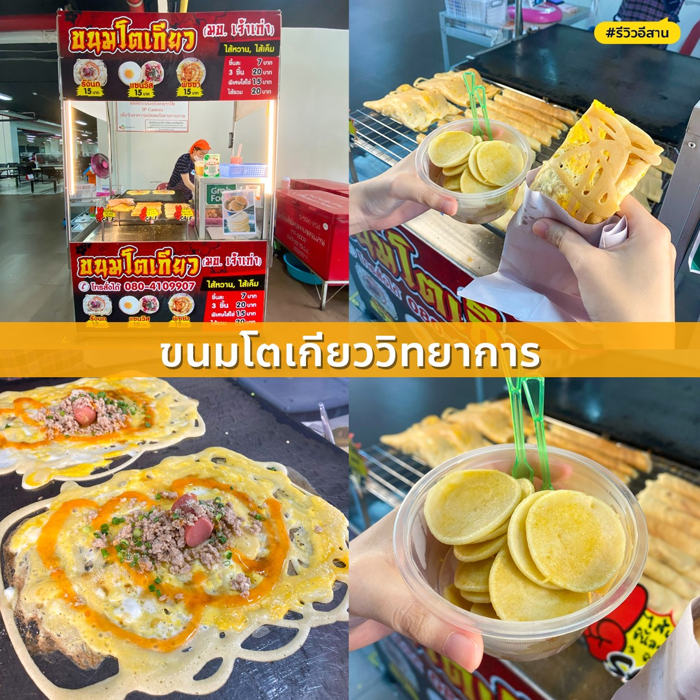

*อ้างอิงข้อมูลและภาพจาก:* [KAD.IN.TH](https://kad.in.th/shop/%E0%B8%A3%E0%B9%89%E0%B8%B2%E0%B8%99%E0%B8%82%E0%B8%99%E0%B8%A1%E0%B9%82%E0%B8%95%E0%B9%80%E0%B8%81%E0%B8%B5%E0%B8%A2%E0%B8%A7-%E0%B8%A1%E0%B8%82-%E0%B8%AB%E0%B8%99%E0%B9%89%E0%B8%B2%E0%B8%84/)

> ขายดีจนต้องขยายสาขา มีหลากหลายไส้ให้เลือก ราคาย่อมเยาว์
> เวลาเปิด-ปิด: 9:00-18:00 น.
> พิกัด: ศูนย์บริการอาหาร 4 ใต้ที่จอดรถคณะวิทยาการจัดการ

#### 2. Lean Station

  * ร้านขายอาหารรักสุขภาพ อาหารและเครื่องดื่มอร่อย
  * เมนูแนะนำ ลาบแซลมอนซาซิมิ
  * เวลาเปิด-ปิด : 11:00 - 19:00 น.
  * พิกัด : หอพักอินเตอร์ มหาวิทยาลัยขอนแก่น

#### 3. พิสมัย

*อ้างอิงข้อมูลและภาพจาก:* [FB Fan Page](https://www.facebook.com/%E0%B8%9E%E0%B8%B4%E0%B8%AA%E0%B8%A1%E0%B8%B1%E0%B8%A2-324692708372559/)

  * อาหารจานเดียว ก๋วยเตี๋ยว เบเกอรี/เค้ก 
  * ร้านเปิดวันจันทร์ - เสาร์ เวลา 10:30 - 20:30 น.
  * พิกัด : ซอยโกโก้มอ ตรงข้ามสนามหญ้าเทียม

#### 4. Little Osaga

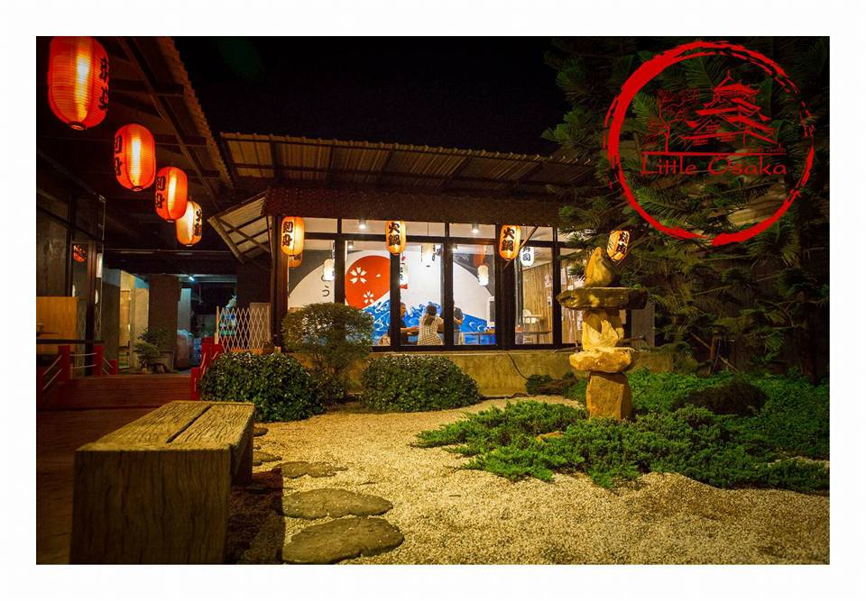

*อ้างอิงข้อมูลและภาพจาก:* [14 ร้านเด็ด น่าโดน ลัดเลาะรอบ "ม.ขอนแก่น"](https://www.ryoiireview.com/article/khonkaenuniversity-all-food-around/)

  * เมนูทางร้านน่าทานมากกกก แถมราคาเหมาะกับนักศึกษาอีกด้วย
  * เมนูแนะนำ ซาซิมิ และข้าวหน้าปลาไหล
  * เวลาเปิด-ปิด : 12:00 - 22:00 น.
  * พิกัด : 122/9 ถนน อดุลยาราม 2 ขอนแก่น (บึงหนองแวง ฝั่งกังสดาล)

#### 5. แล้วแต่ กะเพราแท้ - หลังมอ

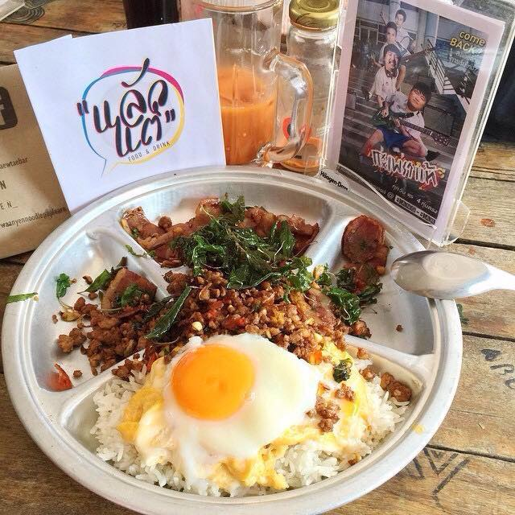

*อ้างอิงข้อมูลและภาพจาก:* https://zappnuar.com/review-khonkaen/laew-tae/

>ร้านอาหารที่ขายแต่เมนูกะเพรา ให้เยอะ มีจานที่แปลกประหลาด
>เวลาเปิด-ปิด : 11.00 - 15.00 น.
>พิกัด: หลังมอ มหาวิทยาลัยขอนแก่น ตำบล ศิลา อำเภอเมืองขอนแก่น ขอนแก่น 40000
>โทร: 086-645-8367

#### 6. ครัวกินกะกิน - หลังมอ

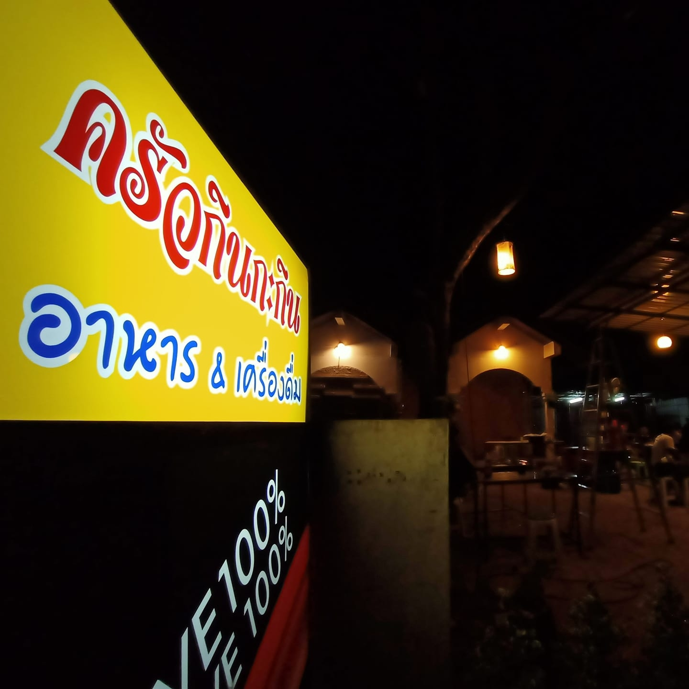

*อ้างอิงข้อมูลและภาพจาก:* https://www.facebook.com/byBenzKhonkaen

> ร้านอาหารตามสั่ง อร่อยจุใจ ให้เยอะ ราคาย่อมเยา
> มีบริการ Lineman และ Grab สามารถใช้คนละครึ่งได้
> เวลาเปิด-ปิด : 17.00 - 02:00 น.
> พิกัด: (ซอยหอ NP Park) หลังมหาวิทยาลัยขอนแก่น
> โทร: 062-103-9339

---
## Cafe :coffee: :cake: :tea:
Here are the best places where you can enjoy your a cup of coffee and delicious desserts.
#### 1. Cafe de Forest

*อ้างอิงข้อมูลและภาพจาก:* [FB Fan Page](https://www.facebook.com/cafedeforestkhonkaen/)

> คาเฟ่ในบรรยากาศสวนและปา ภายในรั้ว มข.
> เวลาเปิด-ปิด : 8:00-18:00 น.
> พิกัด: อยู่หลังสนามกีฬา 50 ปี ใกล้คณะเทคโนโลยี และสะพานขาว

#### 2. 𝐍𝐚𝐩'𝐬 𝐂𝐨𝐟𝐟𝐞𝐞 𝐱 𝐊𝐡𝐨𝐧 𝐊𝐚𝐞𝐧

*อ้างอิงข้อมูลและภาพจาก:* [Pai ka sis :ไปค่ะซิส ツ](https://www.facebook.com/permalink.php?story_fbid=405285714614604&id=108801770929668)

> คาเฟ่ขอนแก่น ฟิลดี เหมือนอยู่ริมทะเล เครื่องดื่มดีงามครัวซองค์สดใหม่ 
> เวลาเปิด-ปิด : 7:00-16:00 น.
> พิกัด: ตลาด62blocks หลังสนามหญ้าเทียม

#### 3. Juicer Coffee

*อ้างอิงข้อมูลและภาพจาก:* [รีวิวขอนแก่น ](https://www.facebook.com/640465002729303/posts/4019355071506929)

> คาเฟ่เล็กๆที่ลึกลับ บรรยากาศอบอุ่น มุมถ่ายรูปเยอะ ใครที่รักธรรมชาติพลาดไม่ได้เลย ที่สำคัญเครื่องดื่มราคาย่อมเยาเข้าถึงง่าย :star::star:
> เวลาเปิด-ปิด : 08.00-18.00 น.
> พิกัด: [หลังมข.ใกล้หอพักเรือนไทยไม้งาม](https://goo.gl/maps/xTCXZpQRPcw5n2aD6)

#### 4. Times Square สาขากังสดาล 

*อ้างอิงข้อมูลและภาพจาก:* [wongnai ](https://www.wongnai.com/reviews/55a89f524b444e7bbb6754d54d0bb8f2)

> คาเฟ่ที่นั่งกว้าง นั่งสบาย บรรยากาศดีมีความเป็นส่วนตัว ปิดดึก เมนูมีทั้งคาวและหวาน 🍨🍦 
> เวลาเปิด-ปิด : 11.00-23.00 น.
> พิกัด: [อยู่ติดร้านปลาวาฬใจดีสาขากังสดาล](https://goo.gl/maps/A7D7qYrngy9LcuwE7)

#### 5. ฌานไม้ 

*อ้างอิงข้อมูลและภาพจาก:* [FB Fan Page]https://web.facebook.com/%E0%B8%8C%E0%B8%B2%E0%B8%93%E0%B9%84%E0%B8%A1%E0%B9%89-306572890176452/

> ร้านอาหารกึ่งคาเฟ่ ภายในรั้ว มข.
> เวลาเปิด-ปิด : 8:00-21:00 น.
> > พิกัด: ฝั่งกังสดาล มหาวิทยาลัยขอนแก่น ใกล้กันกับร้าน Sri Brown Cafe

#### 6. InWhite Café

*อ้างอิงข้อมูลและภาพจาก:* [FB Fan Page](https://www.facebook.com/inwhitecafekk)

> ร้านคาเฟ่สุดชิลพร้อมเครื่องดื่มเเสนอร่อย~
> เวลาเปิด-ปิด : 11:00-22:00 น.
> > พิกัด: ฝั่งกังสดาล มหาวิทยาลัยขอนแก่น ข้างร้าน โอปอ.บุฟเฟต์ 

#### 7. Gravity Coffee Space

*อ้างอิงข้อมูลและภาพจาก:* [Wongnai](https://www.wongnai.com/restaurants/418245rv-gravity-coffee-space)

> ร้านกาแฟ บรรยากาศดี เหมาะแก่การนั่งชิว
> เปิดทุกวัน 08.00-17.00 น.
> > พิกัด:ใกล้ สมาคมศิษย์เก่ามหาวิทยาลัยขอนแก่น

#### 8. ชาโบว์

*อ้างอิงข้อมูลและภาพจาก:* [FB Fan Page](https://www.facebook.com/1506654109551742/posts/1597155350501617/)

> ร้านกาแฟ กินทันที อิ่มแล้วจ๊า
> เปิดทุกวัน 08.00-21.00 น.
> > พิกัด:ใกล้ สมาคมศิษย์เก่ามหาวิทยาลัยขอนแก่น

#### 9. Cocoa More

*อ้างอิงข้อมูลและภาพจาก:* [Wongnai](https://www.wongnai.com/news/cocoa-more-khonkaen)

> โกโก้เข้มข้น รสชาติโกโก้แท้ สูตรเฉพาะของร้านเท่านั้น 
> เปิดทุกวัน 16:00-23:59 น.
> > พิกัด:ตั้งอยู่ติดถนนริมรั้วหลังมข. ประตูเขียว หรือถนนเส้นหลังหออินเตอร์ ร้านจะอยู่เลยคลีนิกหมอฟันมานิดนึง ก่อนถึงสีนานวลสาขาหลังมข 

#### 10. นมวัวบิน

*อ้างอิงข้อมูลและรูปภาพจาก:* [Facebook Fan Page](https://www.facebook.com/Nomvubin)

> เป็นคาเฟ่ที่อยู่ใกล้ ม บรรยากาศดี ราคาก็ดี
> เวลาเปิด-ปิด : 9:00-21:00 น.
> พิกัด: ถนนหลัง มข. เยื้องซุยซุยบาร์ ร้านอยู่ติดกับก๋วยเตี๋ยวเรือสิบสาม

#### 11. LULNa cafe

*อ้างอิงข้อมูลและรูปภาพจาก:* [รีวิวขอนแก่น](https://www.facebook.com/reviewkhonkaen/posts/2576618265780624/)

> คาเฟ่บัวลอยนมสดลึกลับๆหลังมอ เมนูเด็ดคือบัวลอยนมสด ก้อนใหญ่ สอดไส้
> เวลาเปิด-ปิด : 17.00-22.00 น. หยุดวันอังคาร
> พิกัด: ร้านอยู่หลังมอ เข้าซอยร้าน nobicha ตรงมาจนถึงสี่แยกหออยู่เฮง แล้วเลี้ยวขวา รถยนต์หาที่จอดรถยากหน่อย 

#### 12. Mango's House
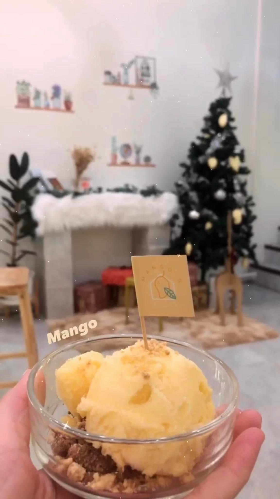

> คาเฟ่มะม่วงน่ารักกลางเมืองขอนแก่น มีการตกแต่งสไตล์น่ารัก สีพาสเทล
> เวลาเปิด-ปิด 10.00 - 22.00 น. เปิดทุกวัน
> พิกัด: ร้านตั้งอยู่ในโครงการ the wall khonkaen ถนนรื่นรมย์
> ร้านไม่ได้มีแค่เมนูเครื่องดื่มอยู่เดียว ยังมีไอศกรีมเพิ่มความเย็นฉ่ำ อย่างเช่น รสมะม่วง รสมะพร้าว

#### 13. Nectar Bowls
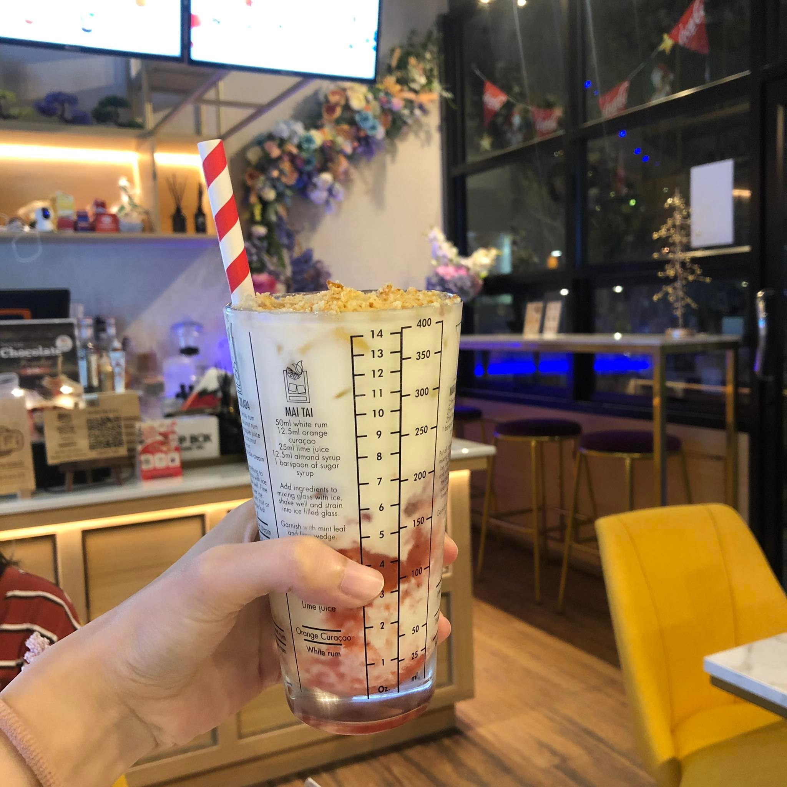

> Smoothie Cafe แห่งใหม่ในเมืองขอนแก่น ร้านน่ารัก มีเครื่องดื่มน่ารับประทาน
> เวลาเปิด-ปิด : เปิดทุกวันเวลา 10.00-21.00 น. 
> พิกัด: โครงการ The Wall ถ.รื่นรมย์ จ.ขอนแก่น

#### 14. The Bitters Sweet KKU หลังม.ขอนแก่น

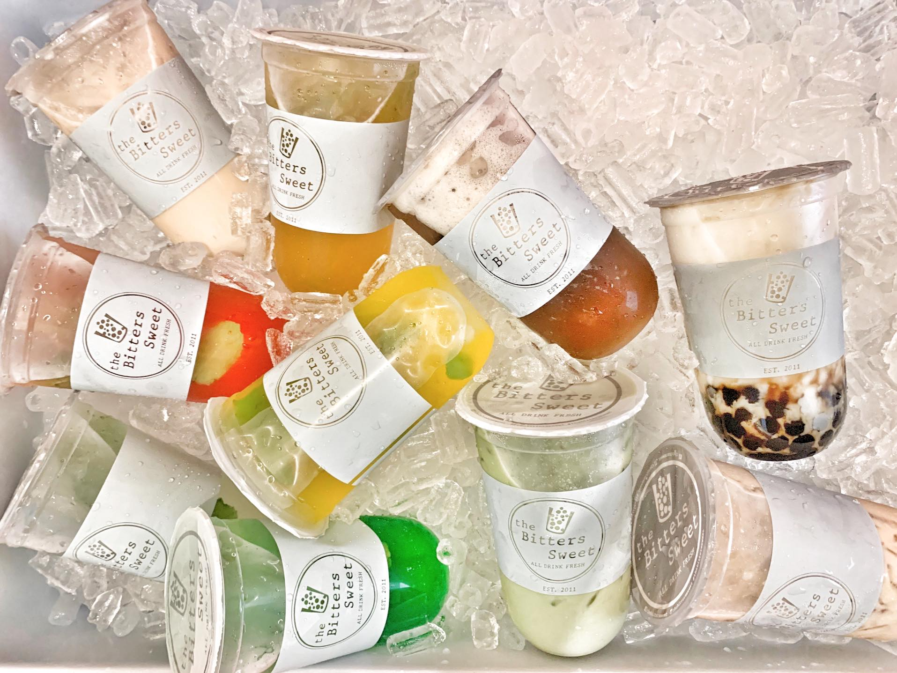

*อ้างอิงข้อมูลและภาพจาก:* [FB Fan Page]https://www.facebook.com/The-Bitters-Sweet-KKU-%E0%B8%AB%E0%B8%A5%E0%B8%B1%E0%B8%87%E0%B8%A1%E0%B8%82%E0%B8%AD%E0%B8%99%E0%B9%81%E0%B8%81%E0%B9%88%E0%B8%99-163233974353142/?ref=page_internal

> ร้านเครื่องดื่ม ชานมไข่มุก นมสด ม๊อกเทล ขนมปัง
> เวลาเปิด-ปิด : 11:00 - 22:00 ทุกวัน
> พิกัด: หลังมหาวิทยาลัยขอนแก่น ทางออกฝั่ง U-Center Khon Kaen District, Khon Kaen

#### 15. Koneko Coffee - โคะเนะโกะ หลังม.ขอนแก่น

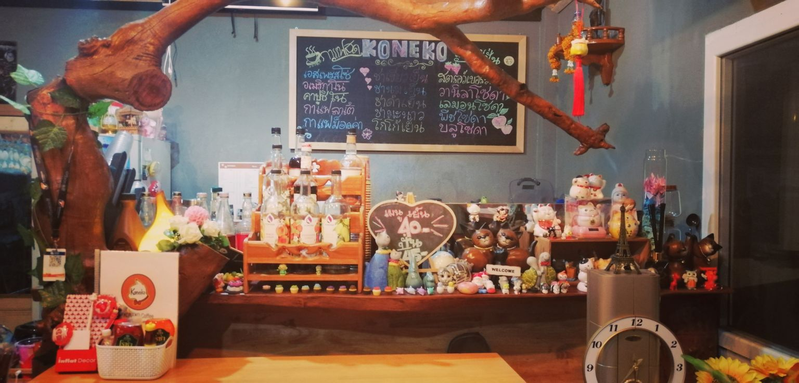

*อ้างอิงข้อมูลและภาพจาก:* [FB Fan Page] https://www.facebook.com/KonekoCoffeeKK
> ร้านเครื่องดื่ม และอาหารตามสั่ง
> เวลาเปิด-ปิด : 10:30 - 20:30 จันทร์ขเสาร์ หยุดอาทิตย์
> พิกัด: 419/8 ม.27 ต.ศิลา อ.เมือง เทศบาลนครขอนแก่น 40000

#### 16. Uncle Duck Cafe - อั๊งเคิล ดั๊ก คาเฟ่ ขอนแก่น

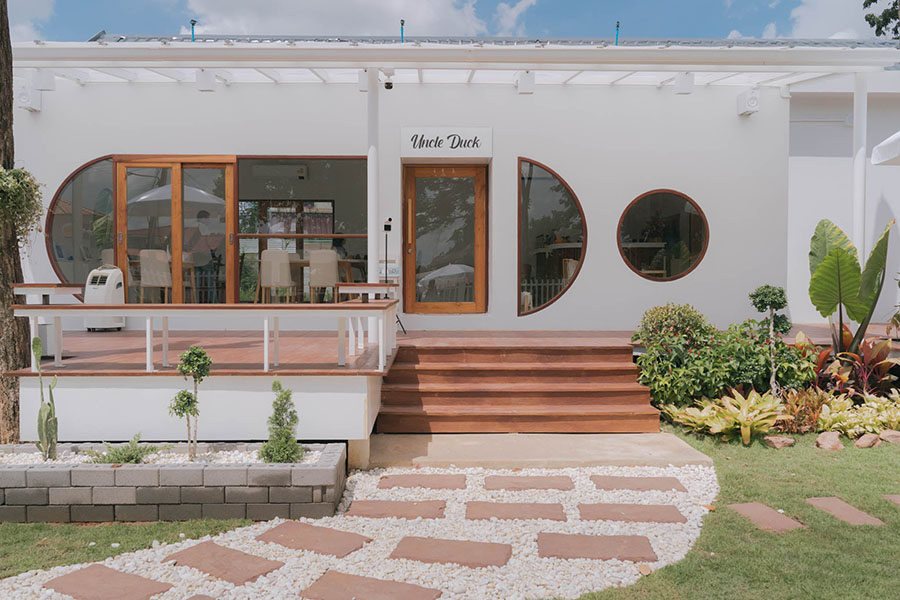

*อ้างอิงข้อมูลและภาพจาก:* https://www.tripgether.com/อัปเดตเรื่องเที่ยว/5-คาเฟ่ขอนแก่นเปิดใหม่/

> คาเฟ่และร้านอาหารสไตล์มินิมอล มีเมนูอาหารและเครื่องดื่ม
> เวลาเปิด-ปิด : 10:00 - 20:00 น.
> พิกัด: ต.ศิลา อ.เมือง เทศบาลนครขอนแก่น 40000
> โทร: 062-285-6885

#### 17. Chomnom Cafe - ชมนม คาเฟ่ ขอนแก่น

*อ้างอิงข้อมูลและภาพจาก:* [Facebook Fan Page](https://www.facebook.com/%E0%B8%8A%E0%B8%A1%E0%B8%99%E0%B8%A1-%E0%B8%84%E0%B8%B2%E0%B9%80%E0%B8%9F%E0%B9%88-Chomnom-Cafe-%E0%B8%A3%E0%B8%B0%E0%B9%80%E0%B8%9A%E0%B8%B5%E0%B8%A2%E0%B8%87%E0%B8%94%E0%B8%B2%E0%B8%A7-Craft-Studio-109820540361406/photos/?ref=page_internal)

> คาเฟ่และร้านอาหารสไตล์มินิมอล มีเมนูอาหารและเครื่องดื่ม
> เวลาเปิด-ปิด : 17:10 - 23:45 น.
> พิกัด: ข้างหอพักฟิวเจอร์ เทศบาลนครขอนแก่น 40000

#### 18. Sri Brown cafe'

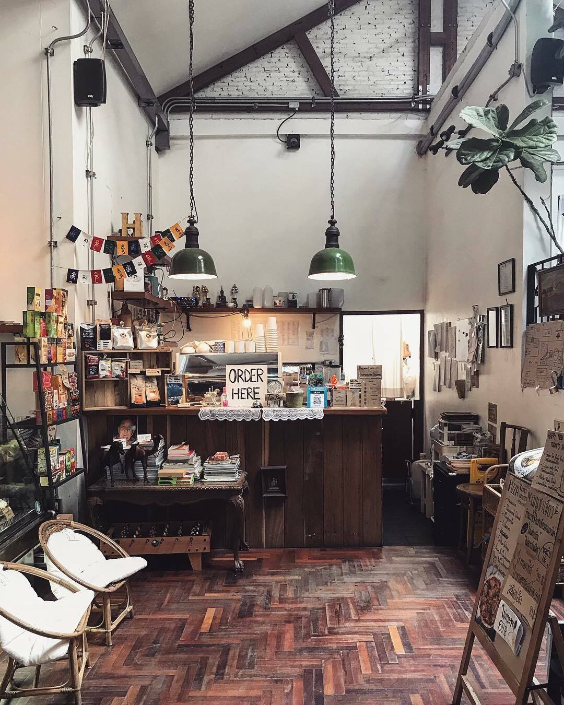

*อ้างอิงข้อมูลและภาพจาก: https://www.facebook.com/Sribrowncafe/
> คาเฟ่เบเกอรี/เค้กของหวาน 
> มีบริการ Grab, Foodpanda 
> เวลาเปิด-ปิด : 07.30 - 19.00 น.
> พิกัด:43/30 หมู่ที่14 อ.เมือง จ.ขอนแก่น 40000 
> เบอร์โทร : 086-715-5611

#### 19. Haneul Home Cafe

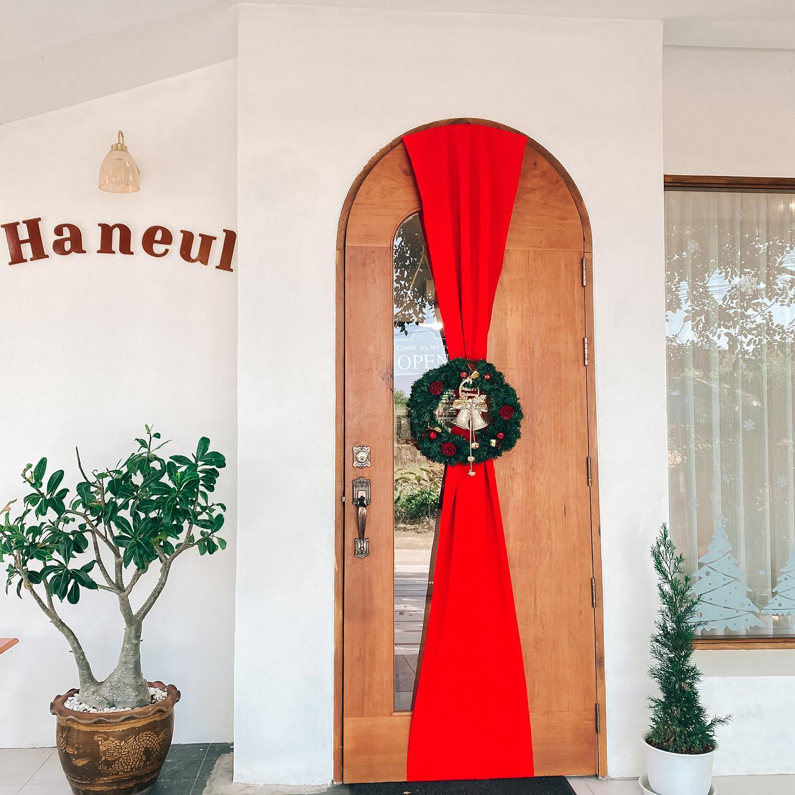

*อ้างอิงข้อมูลและภาพจาก: https://www.facebook.com/haneulhomecafe
> ร้านฮานึล โฮม คาเฟ่ เมืองขอนแก่น ร้านคาเฟ่สไตล์เกาหลี มีความมินิมอล มีมุมให้ถ่ายรูป ค่อนข้างเยอะ
> มีบริการ Grab
> เวลาเปิด-ปิด : 11.00 - 18.00 น.
> พิกัด: 225, 80 ซอย กสิกรทุ่งสร้าง 23/2 ในเมือง, เมือง, Khon Kaen 40000
> เบอร์โทร : 065 901 7134

#### 20. Tibbetts Coffee House

อ้างอิงข้อมูลและภาพจาก: https://www.wongnai.com/restaurants/tibbettscoffee
 * เวลาเปิด-ปิด : อังคาร - ศุกร์ เวลา 	09:30 - 16:30  / เสาร์,อาทิตย์  09:00 - 17:00
 * มี Wi-Fi บริการ
 * มี บริการ เดลีเวอรี

#### 21. April Kaffee

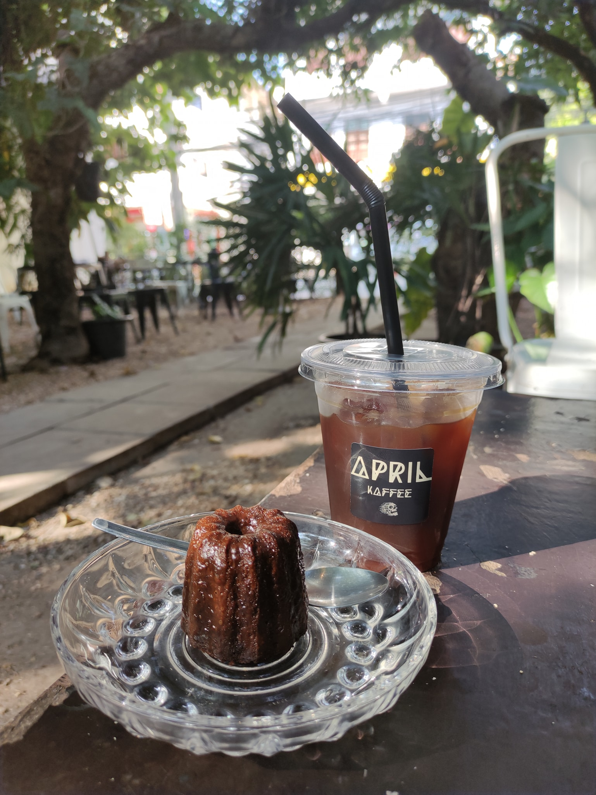

*อ้างอิงข้อมูลจาก:* [Wongnai](https://www.wongnai.com/restaurants/675535nX-april-kaffe)
*อ้างอิงรูปภาพจาก:* [April Kaffee](https://www.facebook.com/April-Kaffee-105170134491887/?ref=page_internal)
 * คาเฟ่เครื่องดื่มชา กาเเฟ นม โซดา เเละขนมเค้ก  
 * มีบริการ LINE MAN 
 * เวลาเปิด-ปิด : 10.00 - 18.00 น.
 * พิกัด : 14 ซอยอดุลยาราม 1 ตำบลในเมือง อำเภอเมืองขอนแก่น จังหวัดขอนแก่น
 * เบอร์โทร : 089 626 7025

#### 22. Chokdee Cafe

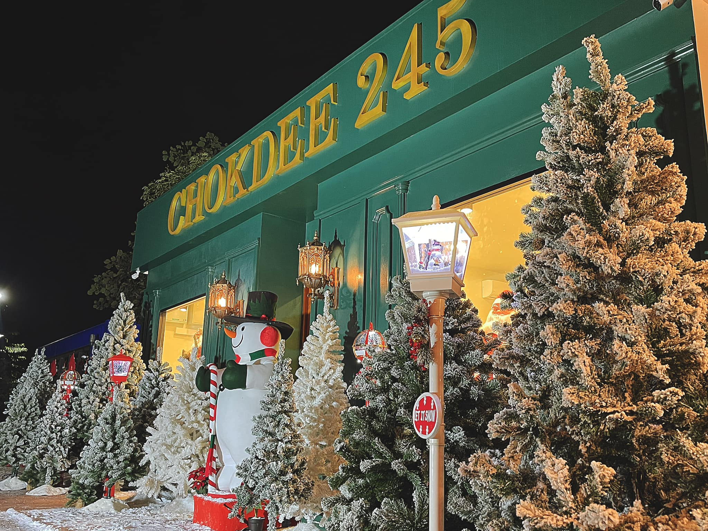

*อ้างอิงข้อมูลและภาพจาก: https://www.facebook.com/ChokdeecafeKK/
> โชคดี คาเฟ่” คาเฟ่วิวหลักล้านอาหารหลักร้อย เปิดใหม่ล่าสุดที่จังหวัดขอนแก่น วิวสวย เครื่องดื่มดี ขนมอร่อย!
> เวลาเปิด-ปิด : 09.00 - 19.00 น.
> พิกัด: Bypass, ขอนแก่น 40000
> เบอร์โทร : 080 452 9415

#### 23. NewBury Coffee House

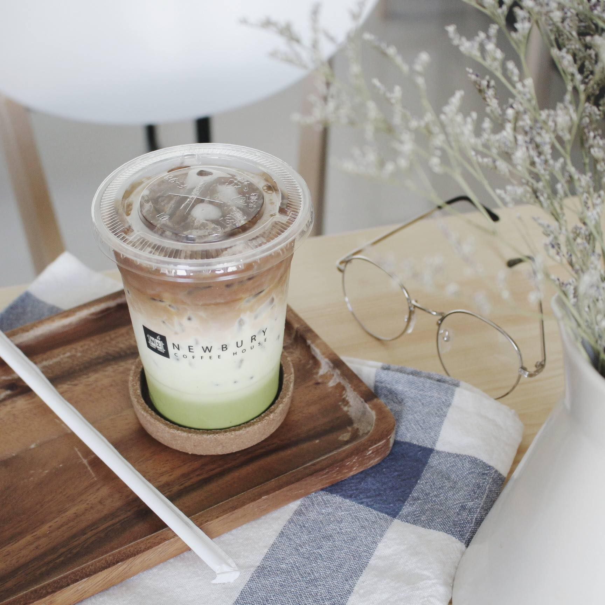

อ้างอิงข้อมูลและภาพจาก: https://www.facebook.com/newburycoffeehouse
>เวลาเปิด-ปิด :  จันทร์ - พฤหัส ,  เสาร์-อาทิตย์ เวลา 	11:00 - 22:30 / ศุกร์  11:00 - 18:00
>รีวิว :  บรรณยากาศภายในร้านเงียบสงบ เหมาะแก่การพักผ่อน อ่านหนังสือและทำงาน  เมนูเครื่องดื่มและของหวานมีความหลากหลาย

#### 24. MarKoff : The Origin
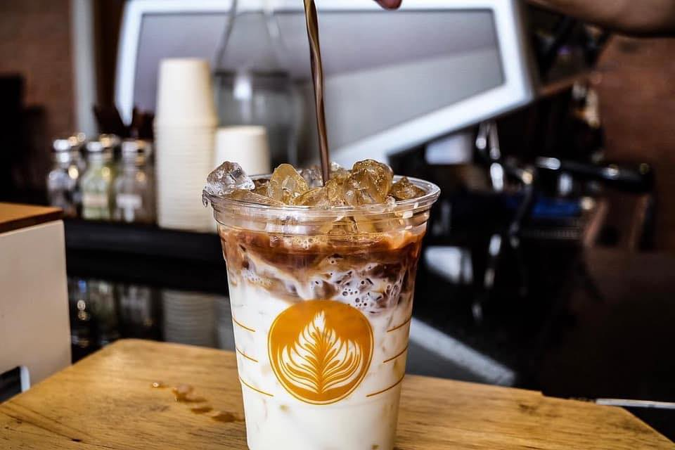

*อ้างอิงข้อมูลและภาพจาก:* https://www.facebook.com/MarKoffcoffee/
> คาเฟ่ชิลๆ อ่านหนังสือและทำงาน
> เวลาเปิด-ปิด : เปิดทุกวันเวลา 07.00 - 23.00 น. 
> พิกัด: กังสดาล ถนนกัลปพฤกษ์

### 25. กะขม cafe 

*อ้างอิงข้อมูลและภาพจาก:* https://www.facebook.com/kakhom.society
>คาเฟ่อ่านหนังสือ พูดคุยกับเพื่อนชิลๆ
>เวลาเปิด-ปิด : เปิดทุกวันเวลา 12.00-22.30 น. 
>พิกัด: ซอยหมู่บ้านมนัสวรรณ หลังมอ

#### 26. Samannachan Cafe
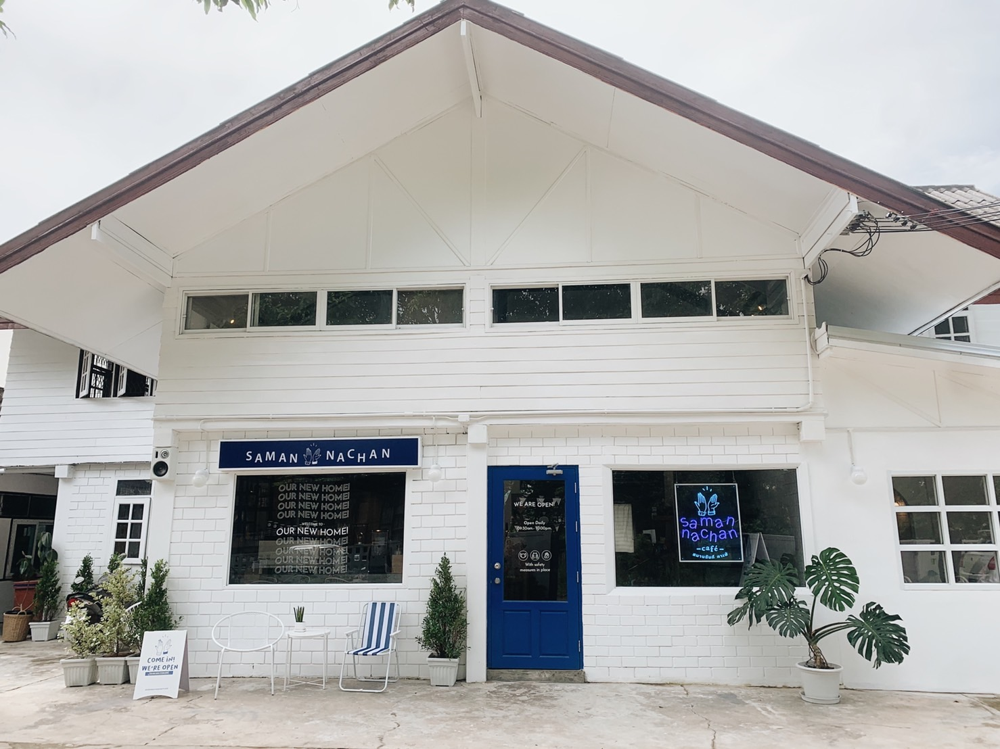

อ้างอิงข้อมูลและภาพจาก: https://www.facebook.com/samannachan.cafe
 * คาเฟ่สายชิล อาหารอร่อย เหมาะสำหรับอ่านหนังสือและทำงาน 
 * เวลาเปิด-ปิด : เปิดทุกวันเวลา 09.30 - 22.00 น. 
 * พิกัด: หลังม.ขอนแก่น 458 ม.12 ซ.ชุติภาแกรนด์เฮ้าส์ ต.ศิลา

#### 27. Dakota Cafe & Co-working Space
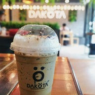
*อ้างอิงข้อมูลและภาพจาก:* https://www.wongnai.com/restaurants/421063OD-dakota-cafe-co-working-space/menu/items/7368284
> คาเฟ่สไตล์ใหม่ที่นั่งเพียบมีหลายโซน มีทั่งแบบที่นั่งเดี่ยว นั่งกับพื้น โต๊ะใหญ่ ปลั๊กเพียบ บรรยากาศสบายๆ มีความเขียวผ่อนคลายดี เงียบสงบ เปิดเพลงแนวบรรเลงเบาๆ
> เวลาเปิด-ปิด : เปิดทุกวัน	07:30 - 23:00 
> พิกัด: 123/1188-1189 หมู่ที่ 16 (ใกล้ยูพลาซ่าหลังมข.) ขอนแก่น (ร้านหลังมข. ฝั่งโนนม่วง หลังหอชาย ถนนหน้ายูพลาซ่า (ยูเซ็นเตอร์))

---

## Street Foods :moneybag: :innocent:
On budget? No problem. There are plenty of delicious and affordable foods around KKU.
#### 1. ศูนย์อาหารและบริการ 2 มข. (โรงชาย)

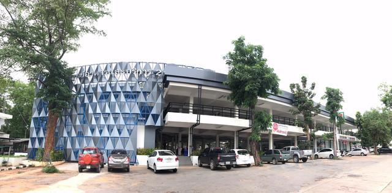</img>

*อ้างอิงข้อมูลและภาพจาก:* [Khon kean Link](https://forum.khonkaenlink.info/index.php?topic=17742692.0)

> ถูกและดี มีอยู่จริง!! มีอาหารให้เลือกหลากหลาย ทั้งข้าวราดแกง อาหารตามสั่ง ก๋วยเตี๋่ยว ผลไม้ และขนมหวาน ตั้งแต่ราคาหลักสิบถึงหลักร้อย
> พิกัด: เยื้องสนามกีฬากลาง มข.
> เวลาเปิด-ปิด: ตลอดเวลา

#### 2. ข้าวมันไก่พี่ยัด ศูนย์อาหารยูเซนเตอร์

รูปภาพจาก https://www.wongnai.com/restaurants/271528hN271528hN-ข้าวมันไก่-มข

> หิวๆต้องมา ถูก ให้เยอะมากกกกกกกกก กไก่ ล้านตัว ในราคาปกติ 40บาทเท่านั้น 
> พิกัด: U-center 

#### 3. ก๋วยเตี๋ยว & กะเพรา By คุณเสริม

</img>

*อ้างอิงข้อมูลและภาพจาก:* [Facebook Fan Page](https://www.facebook.com/เตี๋ยวเนื้อตุ๋นหมูตุ๋นกะเพราน่องลายbyคุณเสริมสาขาโรงอาหารชาย-มข-639855569773571)

> หนึ่งในร้านขายกะเพราที่เรียกได้ว่าอร่อยมากๆ ภายใน มข. นอกจากนี้ยังมีเมนูประเภทก๋วยเตี๋ยวให้ลิ้มลอง
> เวลาเปิด 07.00-16.00 น. (ถ้าวัตถุดิบหมดก็จะปิดร้านทันที)
> พิกัด ศูนย์อาหารและบริการ 2 (โรงชายใหม่) ตรงข้าม สนามกีฬา 50 ปี

#### 4. โบโบ้เครป&นมสด หลังมอ

*อ้างอิงรูปภาพจาก:* [เครปโบโบ้ สาขาแฟรี่](https://www.facebook.com/%E0%B9%80%E0%B8%84%E0%B8%A3%E0%B8%9B%E0%B9%82%E0%B8%9A%E0%B9%82%E0%B8%9A%E0%B9%89-%E0%B8%AA%E0%B8%B2%E0%B8%82%E0%B8%B2%E0%B9%81%E0%B8%9F%E0%B8%A3%E0%B8%B5%E0%B9%88-107714670918042/)

  * เป็นร้านเครปที่ให้ไส้เยอะมาก และอร่อยมาก มีไส้และแป้งให้เลือกหลากหลายและราคาถูก
  * เวลาเปิด-ปิด : 18:00 - 23:30 น.
  * พิกัด : หลังมอ เยื้องกับสถานีตำรวจภูธรย่อย มข

#### 5. โซล ชิกเก้น (กังสดาล)

*อ้างอิงรูปภาพจาก:* [Foodpanda ](https://www.foodpanda.co.th/th/restaurant/v7up/seoul-chicken-kangsadarn)

  * เป็นร้านอาหารเกาหลีที่อร่อยมากๆ ไก่มีความใกล้เคียงกับ Bonchon
  * แนะนำซอสเผ็ดอร่อยมากกกกกกกกกกกกกกกกกก
  * ราคาอยู่ในระดับกลางๆ
  * เวลาเปิด-ปิด : 11:00 - 20:45 น.
  * พิกัด : กังสดาล [Google Maps](https://goo.gl/maps/nwu9VKXpzxujQcDq6)

#### 6. มาหาเจียว หลังมอ

*อ้างอิงรูปภาพจาก:* [Foodpanda](https://www.foodpanda.co.th/th/restaurant/z1jc/maha-fast-food-by-maha-jieow)

  * เป็นร้านอาหารตามสั่งที่มีความโดดเด่นคือเมนูไข่เจียวใส่ชีส
  * แนะนำให้ใส่ชีสแผ่นเพิ่ม
  * เวลาเปิด-ปิด : 10:00 - 20:00 น.
  * พิกัด : หลังมอแถว U-Center
 
 
#### 7. เย็นใจไอศกรีม

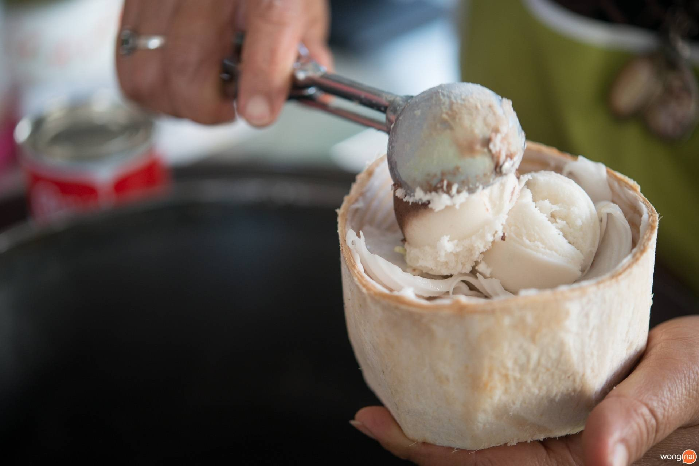

*อ้างอิงข้อมูลและภาพจาก:* (https://m.facebook.com/HungryKhonkaen/photos/pcb.2946618868891696/2946612725558977/?type=3&source=48)

> เวลาเปิด-ปิด : จันทร์-ศุกร์ 10:00 - 17:00
> > พิกัด: ถนนมิตรภาพ ขอนแก่น หลังคณะศึกษาศาสตร์ ในโรงอาหารคณะศึกษาศาสตร์

#### 8. มะม่วงป้ากุ้ง

*อ้างอิงรูปภาพจาก:* [Facebook : รีวิวอีสาน ](https://www.facebook.com/reviewkhonkaen/photos/pcb.3713221498786956/3713215475454225)

  * ร้านมะม่วงที่ได้มะม่วงเยอะมากกกก คุ้มค่าในราคา 25 บาท
  * แถมน้ำจิ้มก็เด็ดมากกก อร่อยมากๆ ทุกคนจะได้ชิมมะม่วงในรสชาติที่ตัวเองชอบ
  * เวลาเปิด ประมาณ 11.00 - 18.00 น.
  * พิกัด : ข้างหอสมุด เยื้องทางคณะเกษตรศาสตร์

#### 9. สามอ้วนชวนกิน

*อ้างอิงรูปภาพจาก:* [สามอ้วนชวนกิน](https://www.google.com/maps/uv?pb=!1s0x31228a9a122fab65%3A0x572dd093185c6e77!3m1!7e115!4shttps%3A%2F%2Flh5.googleusercontent.com%2Fp%2FAF1QipOZQnbf9kbb1EmqDWQeWXIyIeJwZa3lfyLuBo0v%3Dw213-h160-k-no!5z4Liq4Liy4Lih4Lit4LmJ4Lin4LiZ4LiK4Lin4LiZ4LiB4Li04LiZIOC4geC5i-C4p-C4ouC4iOC4seC5iuC4muC4reC4uOC4muC4pSAtIEdvb2dsZSBTZWFyY2g!15sCgIgAQ&imagekey=!1e10!2sAF1QipOZQnbf9kbb1EmqDWQeWXIyIeJwZa3lfyLuBo0v&hl=en&sa=X&ved=2ahUKEwjCpo2w0Kz1AhVqTWwGHcYFAxsQoip6BAglEAM#)

  * แนะนำเมนู ก๋วยจั๊บอุบล
  * เวลาเปิด ประมาณ 11:00 - 19:00 น.
  * พิกัด : ซอยอิงมอ 3

#### 10. ณรงค์ข้าวมันไก่ตอน
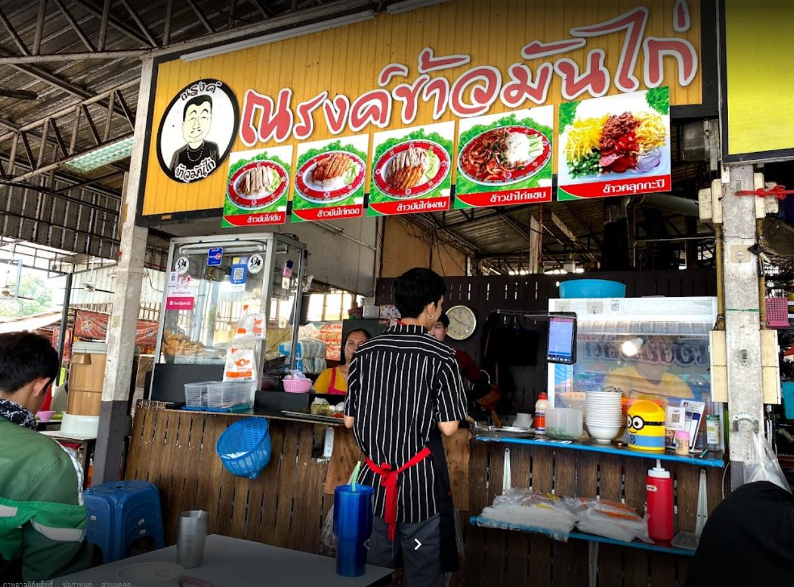
อ้างอิงรูปภาพจาก:* [Facebook : รีวิวอีสาน ](https://www.google.com/maps/uv?pb=!1s0x31228a6080d890d1%3A0x2f61479dc3782481!3m1!7e115!4shttps%3A%2F%2Flh5.googleusercontent.com%2Fp%2FAF1QipNMtT7-H3zlPg_1UxYZEZYBXOwdFA6nMksO6Fjj%3Dw260-h175-n-k-no!5z4LiC4LmJ4Liy4Lin4Lih4Lix4LiZ4LmE4LiB4LmIIOC4guC4reC4meC5geC4geC5iOC4mSAtIOC4hOC5ieC4meC4q-C4suC4lOC5ieC4p-C4oiBHb29nbGU!15sCgIgAQ&imagekey=!1e10!2sAF1QipNMtT7-H3zlPg_1UxYZEZYBXOwdFA6nMksO6Fjj&hl=th)

  * แนะนำเมนู ข้าวมันไก่ต้ม
  * เวลาเปิด ประมาณ 7:00–20:00 น.
  * พิกัด : ศูนย์อาหารกังสดาล ถ. กัลปพฤกษ์ ตำบลในเมือง อำเภอเมืองขอนแก่น ขอนแก่น 40000
  
## Authentic E-SAN Foods :cow: :evergreen_tree: :evergreen_tree: :horse:
Wanna eat like the locals? Try these.

#### 1. มิตรภาพลาบก้อย

รูปภาพจาก https://www.wongnai.com/photos/06f2d745f2164661b256421a8a42a565

> เวลาเปิด-ปิด : 16:00 - 11:00 น. 
> พิกัด: ถนนมิตรภาพ

#### 2. แตงโมแซ่บเวอร์ หลังมอ
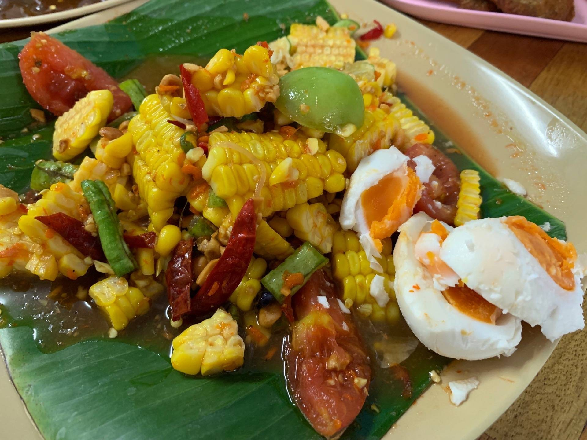
*อ้างอิงข้อมูลและรูปภาพจาก:* (https://www.wongnai.com/restaurants/242357zi-%E0%B9%81%E0%B8%95%E0%B8%87%E0%B9%82%E0%B8%A1%E0%B9%81%E0%B8%8B%E0%B9%88%E0%B8%9A%E0%B9%80%E0%B8%A7%E0%B8%AD%E0%B8%A3%E0%B9%8C-%E0%B8%AB%E0%B8%A5%E0%B8%B1%E0%B8%87%E0%B8%A1%E0%B8%AD)

> เมนูแนะนำ: ตำข้าวโพดไข่เค็ม
> เวลาเปิด-ปิดร้าน: อังคาร-อาทิตย์  10:00-20:00 น.
> เบอร์โทร : 0934415075

#### 3. ลาบ ก้อย ซ.นานา 
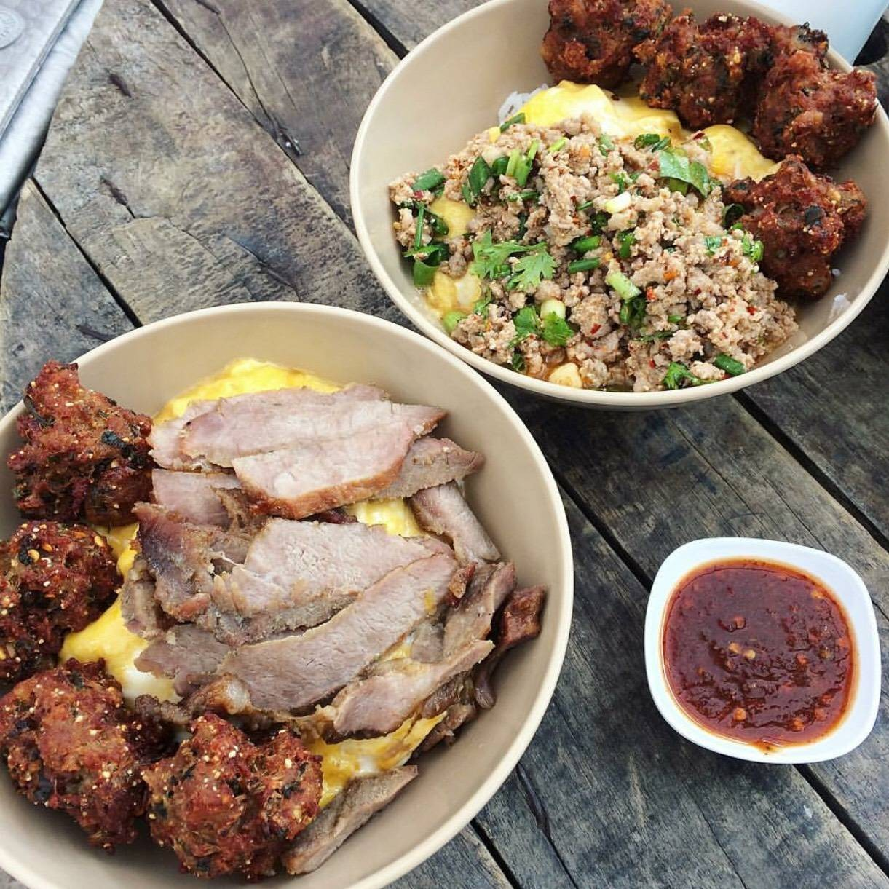
*อ้างอิงข้อมูลและรูปภาพจาก:* (https://www.wongnai.com/photos/86ef962a6208414e887cf2fcafebb4c4)

> เมนูแนะนำ: เนื้อเสือร้องไห้
> เวลาเปิด-ปิดร้าน : จันทร์	15:30 - 02:00
> อังคาร	15:30 - 23:30
> พุธ	00:00 - 02:00
> พฤหัสบดี - อาทิตย์	15:30 - 02:00 
> เบอร์โทร : 0817171795

#### 4. ตำเมียป๋า
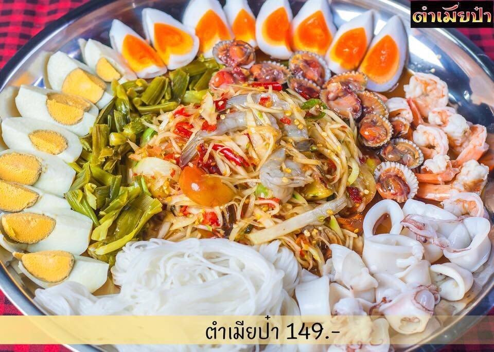
*อ้างอิงข้อมูลและรูปภาพจาก:* (https://www.wongnai.com/restaurants/425765cN-%E0%B8%95%E0%B8%B3%E0%B9%80%E0%B8%A1%E0%B8%B5%E0%B8%A2%E0%B8%9B%E0%B9%8B%E0%B8%B2/photos/0be9c4d1fb204df48c199f2a027cc52a)

> เมนูแนะนำ: ตำเมียป๋า
> เวลาเปิด-ปิดร้าน : จันทร์-พฤหัสบดี	10:30 - 20:30
> เสาร์-อาทิตย์	 10:30 - 20:30
> เบอร์โทร : 0868637141

---
## Fine Dining and Restaurants  :camera: :sunflower:
Love to impress you Instragram followers? Here are the places where you can take stunning pictures, nice foods, and excellent services.

#### 1. Bayasita@KKU

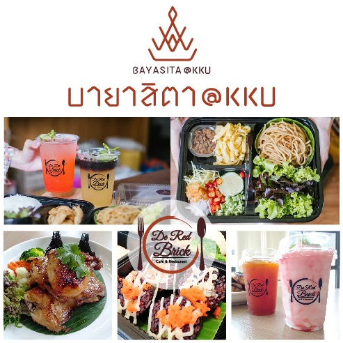

*อ้างอิงข้อมูลและรูปภาพจาก:* [Bayasita@KKU](https://bayasita.kku.ac.th/)

> ไหว้เจ้าพ่อมอดินแดงเสร็จไปรับประทานอาหารในบรรยากาศหรูหราต่อ ให้บริการทั้งร้านอาหาร ที่พัก และคาเฟ่ มีบริการอาหารที่ทำจากผลผลิตภายในรั่วมหาวิทยาลัยขอนแก่น
> พิกัด: ตรงข้ามเจ้าพ่อมอดินแดง ติดคณะสัตวแพทยศาสตร์

#### 2. สเต็กบ้านเต้ง สาขา ม.ขอนแก่น

*อ้างอิงข้อมูลและภาพจาก:* [สเต็กบ้านเต้ง ม.ขอนแก่น & Mr.Teng Steak](https://www.facebook.com/Steakbaantengkk)

> ต้นตำรับสเต็กบ้านเต้ง รสชาติที่ทุกคนคุ้นเคย 10 ปี
ร้านเปิดทุกวัน ตั้งแต่ 10.00-22.00น.
โทร: 083-4569270
พิกัด: ที่ตั้ง ริมบึงหนองแวงตราชู ฝั่งกังสดาล อ.เมือง จ.ขอนแก่น

#### 3. T-Bone Steak 

*อ้างอิงข้อมูลและภาพจาก:* [T-Bone Steak](https://www.facebook.com/tbonekk/photos/a.3794468787251502/3873879389310441/)

> ไม่พูดมาก เพราะมันอร่อยมากกกกกกกกก
ร้านเปิดทุกวัน ตั้งแต่ 17.00-23.00น.
โทร: 094 542 8366
พิกัด: ที่ตั้ง 204/150 หมู่14 เทศบาลนครขอนแก่น ฝั่งกังสดาล อ.เมือง จ.ขอนแก่น 40000

#### 4. รอยยิ้มสเต๊ก 

*อ้างอิงข้อมูลและภาพจาก:* [รอยยิ้มสเต๊ก](https://zappnuar.com/review-khonkaen/%E0%B8%A3%E0%B8%AD%E0%B8%A2%E0%B8%A2%E0%B8%B4%E0%B9%89%E0%B8%A1%E0%B8%AA%E0%B9%80%E0%B8%95%E0%B9%8A%E0%B8%81%E0%B8%99%E0%B8%A1%E0%B8%AA%E0%B8%94/)

> เมนูสเต๊กที่ร้านนี้ คือมีให้สเต๊กให้เลือกทานกันหลากหลายประเภท ไม่ว่าจะเป็น หมู ไก่ ปลา หรือแม้กระทั่งสเต๊กเนื้อโคขุน นอกจากเมนูสเต๊กแล้ว ที่ร้านนี้ยังมีในส่วนของอาหารอื่น ๆ อีกมากมาย เรียกได้ว่าเลือกทานกันไม่หวาดไม่ไหวเลยทีเดียว อร่อยไม่แพ้สเต๊กเลย
ร้านเปิดทุกวัน ตั้งแต่ 16.00-22.00น.
โทร: 089-942-5157
พิกัด: ที่ตั้ง 222/12 ถนนกัลปพฤกษ์ ฝั่งกังสดาล-ชุมชนตะวันใหม่ ต.ในเมือง, 40000 อ.เมือง ขอนแก่น (ร้านอยู่ในซอยร้านประจำ ข้างฌาร์ม บูทีค รีสอร์ท)

#### 5. สีนานวล คาเฟ่ กังสดาลมข.

*อ้างอิงข้อมูลและภาพจาก:* [wongnai](https://www.wongnai.com/listings/must-try-restaurants-khonkaen)

>ร้านอาหารเมนูน่ากิน รสชาติดี ร้านตำนานในขอนแก่น ร้านตกแต่งมีสไตล์ อาหารที่นี่ใส่ภาชนะมาเสิร์ฟดูสวยงาม เมนูเด็ด “ปลากะพงยำมะม่วง” และ “แกงส้มชะอมกุ้ง” อาหารอร่อย และมีคุณภาพ ร้านนี้เหมาะที่จะพาครอบครัวมากิน อาหารมีหลากหลาย เข้ากับทุกคนในครอบครัว 
โทร: 043001200
พิกัด: 164 160 หมู่ที่ 14 ถนน ตะวันใหม่ ตำบลในเมือง อำเภอเมืองขอนแก่น ขอนแก่น 40000

#### 6. แจ่วฮ้อนอภิรมย์ สาขา มข 

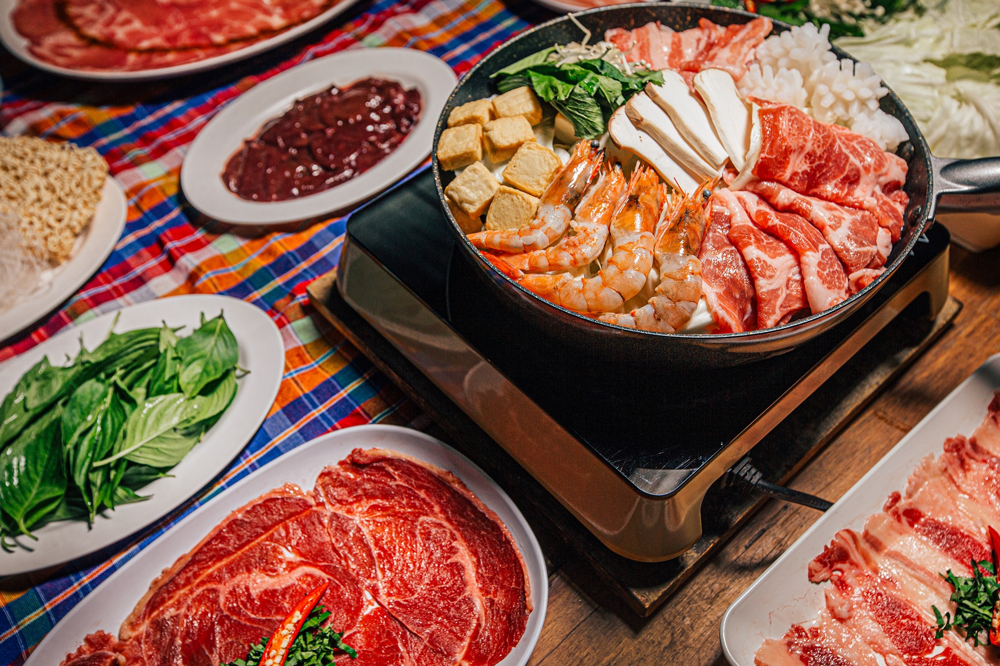

*อ้างอิงข้อมูลและภาพจาก:* [Wongnai](https://www.wongnai.com/restaurants/290471Zv-%E0%B9%81%E0%B8%88%E0%B9%88%E0%B8%A7%E0%B8%AE%E0%B9%89%E0%B8%AD%E0%B8%99%E0%B8%AD%E0%B8%A0%E0%B8%B4%E0%B8%A3%E0%B8%A1%E0%B8%A2%E0%B9%8C-%E0%B8%AA%E0%B8%B2%E0%B8%82%E0%B8%B2-%E0%B8%A1%E0%B8%82) & [Facebook Fanpage](https://web.facebook.com/apiromkku/?_rdc=1&_rdr)

* ร้านแจ่วฮ้อนอภิรมย์ มีความเอกลักษณ์อยู่ที่น้ำจิ้มสูตรเด็ดเข้มข้น เพราะเป็นได้ทั้งน้ำซุปและน้ำจิ้มในขวดเดียวกัน เมนูก็มีทั้งชุดเนื้อหมู เนื้อโค และซีฟู้ด อีกทั้งยังมีเมนูของหวานให้เลือกได้อีกหลากหลาย
* ร้านมีบริการที่จอดรถ และ Wi-fi ฟรี หรือหากไม่สะดวกมานั่งทานที่ร้านก็ยังมีบริการเดลิเวอรีส่งให้ถึงที่
* พิกัดร้าน : ตั้งอยู่ฝั่งกังสดาล 43/134 ม.14 ซ.อดุลยาราม ถ.มิตรภาพ ต.ในเมือง อ.เมืองขอนแก่น เทศบาลนครขอนแก่น 40000 
* เวลาเปิดร้าน : ทุกวัน เวลา 11:00 น. - 21:00 น.
* เบอร์โทร : 0910549232 , 0951780890 

#### 7. NHAMAI

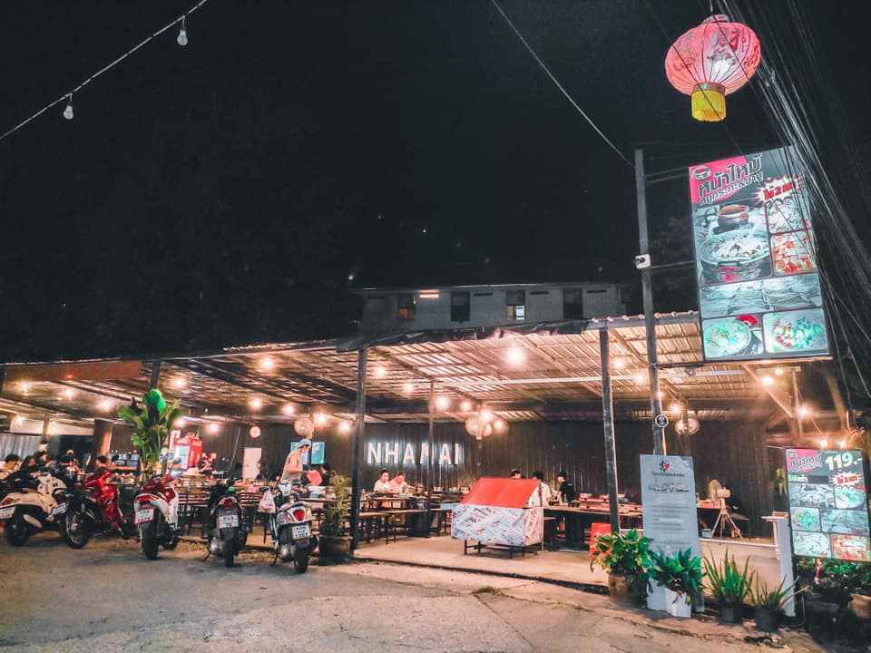

* ราคาสบายกระเป๋า น้ำจิ้มอร่อยสุดๆ เหมาะพาแฟนไปเดท แต่ถ้าไม่มีก็ไปกับเพื่อนก็ได้ 55555555
* ร้านเปิดทุกวัน 16.00 - 24.00 น.
* 293/10 หมู่ 12 ต.ศิลา อ.เมือง เทศบาลนครขอนแก่น 40000 (ซอยหลังสนามเบสบอล)
* อ้างอิงข้อมูลและภาพจาก:[Facebook Fanpage](https://web.facebook.com/Namai.KhonKaen/photos/pcb.1032196240660444/1032194313993970/)

---
## Public Events :dancer: :dancers:
Looking for souvenirs or buying the essestials? There are many places for you to go.  KKU is full of public events with food stalls. Some are free. Some are not. Here is the list.

#### 1. มอดินแดง Avenue

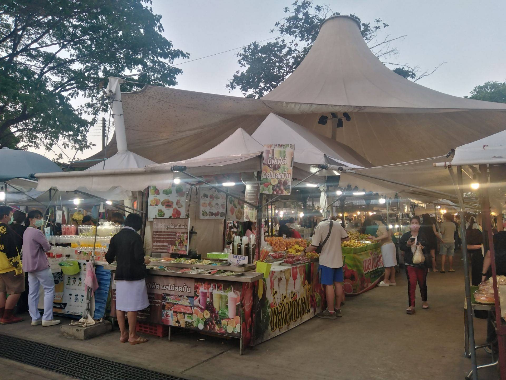</img>

*อ้างอิงข้อมูลและภาพจาก:* [Wongnai](https://www.wongnai.com/trips/night-markets-khonkaen)

* ตลาดมอดินแดง Avenue หรือ ตลาดโรงชาย มีของให้เลือกช็อปมากมายทั้งอาหารและเสื้อผ้า บริเวณที่ขายอาหาร มีพื้นที่สำหรับนั่งกินไว้บริการ</li>
* เวลาเปิด 15:00 - 21:00 น.</li>
* พิกัด หลังอาคารศูนย์คอมเพล็กซ์ มหาวิทยาลัยขอนแก่น [Google Maps](https://www.google.com/maps?q=%E0%B8%95%E0%B8%A5%E0%B8%B2%E0%B8%94%E0%B8%A1%E0%B8%AD+%E0%B8%A1%E0%B8%82&source=lmns&bih=937&biw=1920&rlz=1C1CHBF_enTH911TH911&hl=en&sa=X&ved=2ahUKEwjDkeuH37D1AhV4BrcAHcZ6DgUQ_AUoAXoECAEQAQ)

#### 2. เปิดท้าย มข.

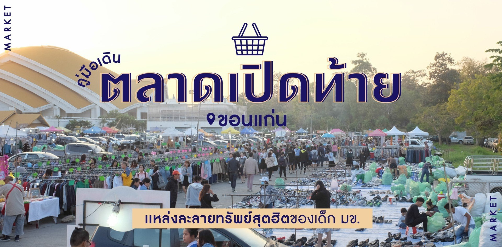</img>

*อ้างอิงรูปภาพจาก:* [Wongnai](https://www.wongnai.com/trips/night-market-khonkaen-university)
*ติดตามข่าวสารจากเพจหลัก:* [FB Fanpage](https://th-th.facebook.com/marketkku/)

* แหล่งช็อปปิงสุดฮิตของคนขอนแก่นในมข. แบ่งแยกโซนอาหารเเละโซนของใช้ มีสินค้ามือสองให้เลือกอีกด้วย</li>
* เวลาเปิด 17:00 - 22:00 น.</li>
* พิกัด บริเวณลานจอดรถด้านศูนย์ประชุมอเนกประสงค์กาญจนาภิเษก [Google Maps](https://www.google.com/maps?q=%E0%B9%80%E0%B8%9B%E0%B8%B4%E0%B8%94%E0%B8%97%E0%B9%89%E0%B8%B2%E0%B8%A2+%E0%B8%A1%E0%B8%82.&source=lmns&bih=937&biw=1920&rlz=1C1CHBF_enTH911TH911&hl=th&sa=X&ved=2ahUKEwiZqcKE4bD1AhWyQ3wKHZ5KCyoQ_AUoAXoECAEQAQ)

---
##  Grab and Go :running: :muscle:
In a rush? Let's grab a bite to eat.

#### 1. ผัดไทยไร้เส้น-ตลาดหอแปดหลัง

</img>

*อ้างอิงข้อมูลและภาพจาก:* [food.grab.com/th](https://food.grab.com/th/th/restaurant/ผัดไทยไร้เส้น-ตลาดหอแปดหลัง-delivery/3-CZACAYBJR8MAGN)

<ul>
<li>> แนะนำกะเพราไก่อร่อยมาก</li>
<li>> เวลาเปิด 07:30-20:30 น.</li>
<li>> พิกัด ตลาดหอแปดหลัง</li>
</ul>

#### 2. ไก่จ๋า - ตลาดมอดินแดง

*อ้างอิงข้อมูลและรูปภาพจาก:* [ไก่จ๋า - ตลาดมอดินแดง](https://food.grab.com/th/th/restaurant/%E0%B9%84%E0%B8%81%E0%B9%88%E0%B8%88%E0%B9%8B%E0%B8%B2-%E0%B8%95%E0%B8%A5%E0%B8%B2%E0%B8%94%E0%B8%A1%E0%B8%AD%E0%B8%94%E0%B8%B4%E0%B8%99%E0%B9%81%E0%B8%94%E0%B8%87-delivery/3-CZJTA35CCLAHR2)

  * ร้านขายมาม่าและไก่เกาหลี ซอสมาม่าอร่อยมากก เหมาะสำหรับคนที่ไม่ชอบมาม่าที่แห้งเกินไป
  * เวลาเปิด : 16:00 น.
  * พิกัด : ศูนย์อาหารและบริการ 3 (หนองแวง)
  
#### 3. ไก่รสทิพย์ - กังสดาล

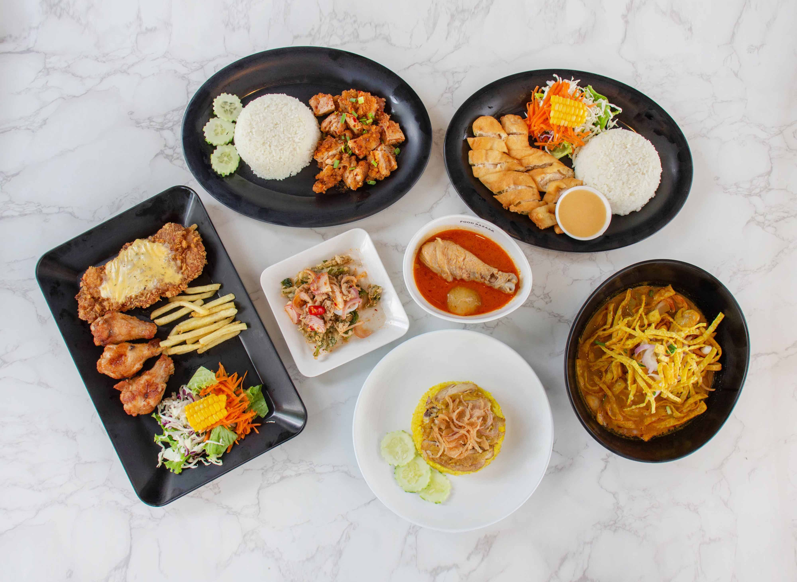

*อ้างอิงข้อมูลและรูปภาพจาก:* [ไก่รสทิพย์ - กังสดาล](https://food.grab.com/th/th/restaurant/%E0%B9%84%E0%B8%81%E0%B9%88%E0%B8%A3%E0%B8%AA%E0%B8%97%E0%B8%B4%E0%B8%9E%E0%B8%A2%E0%B9%8C-%E0%B8%81%E0%B8%B1%E0%B8%87%E0%B8%AA%E0%B8%94%E0%B8%B2%E0%B8%A5-delivery/3-CZATNFTUTACXNT)

 * ร้านอาหารสุดอร่อย มีเมนูมากมาย เช่น จานเดียว,สเต๊ก,เมนูตามสั่ง มีวัตถุดิบจำพวกไก่,เนื้อวัว,ทะเล แต่จะไม่มีหมู เพราะพี่เจ้าของร้านนับถือศาสนาอิสลาม
  * เวลาเปิด : 10:00 - 20:00 น.
  * พิกัด : ไก่รสทิพย์ กังสดาล [Google Map](https://www.google.com/maps/place/%E0%B8%A3%E0%B9%89%E0%B8%B2%E0%B8%99%E0%B9%84%E0%B8%81%E0%B9%88%E0%B8%A3%E0%B8%AA%E0%B8%97%E0%B8%B4%E0%B8%9E%E0%B8%A2%E0%B9%8C/@16.4602189,102.8255131,17z/data=!3m1!4b1!4m5!3m4!1s0x31228a6743397793:0x86a6546b2c7d578d!8m2!3d16.4602189!4d102.8277018?hl=th)  

#### 4. บิงซู ไก่เกาหลี อาหารเกาหลี Seoulmind KhonKaen
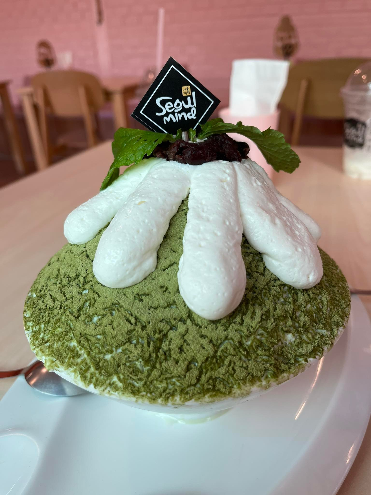

  * ร้านอาหารและขนมสไตล์เกาหลี ไก่ทอด บิงซู กาแฟ
  * พิกัดร้าน : ถนน เส้นหลัง 62 blocs
  * โทร: 0614539152
  *เปิด11:30 น ถึง 21:00 น
  
#### 5. โจ๊กป้าแดง - ถนนกัลปพฤกษ์
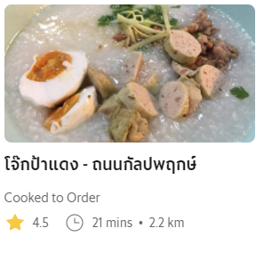

*อ้างอิงข้อมูลและรูปภาพจาก:* [โจ๊กป้าแดง - ถนนกัลปพฤกษ์](https://food.grab.com/th/en/restaurant/%E0%B9%82%E0%B8%88%E0%B9%8A%E0%B8%81%E0%B8%9B%E0%B9%89%E0%B8%B2%E0%B9%81%E0%B8%94%E0%B8%87-%E0%B8%96%E0%B8%99%E0%B8%99%E0%B8%81%E0%B8%B1%E0%B8%A5%E0%B8%9B%E0%B8%9E%E0%B8%A4%E0%B8%81%E0%B8%A9%E0%B9%8C-delivery/3-CYVTUCDKTKXCNT)

  * ร้านโจ๊กและก๋วยจั๊บที่พึ่งในยามกลางคืน
  * เวลาเปิด : 00.00 - 23.59 น.

  #### 6. On-Zon ออนซอน แจ่วฮ้อน&ชาบู - ขอนแก่น

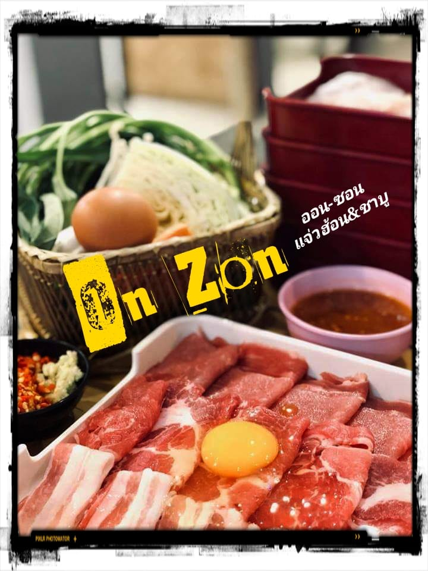</img>

*อ้างอิงข้อมูลและภาพจาก:* [Facebook Fan Page](https://www.facebook.com/onzonbuffet)

> ร้านบุฟเฟ่ต์ แจ่วฮ้อน&ชาบู ที่มีความพิเศษที่หม้อชาบูมีน้ำซุปแจ่วฮ้อนและน้ำซุปชาบู
> เวลาเปิด 16.00-10.30 น. 
> 161 บ้านโนนม่วง หมู่ที่ 3 ต.ศิลา Khon Kaen District, Khon Kaen, Thailand 40000

#### 7. กะเพราซาวห้า กังสดาล - ขอนแก่น

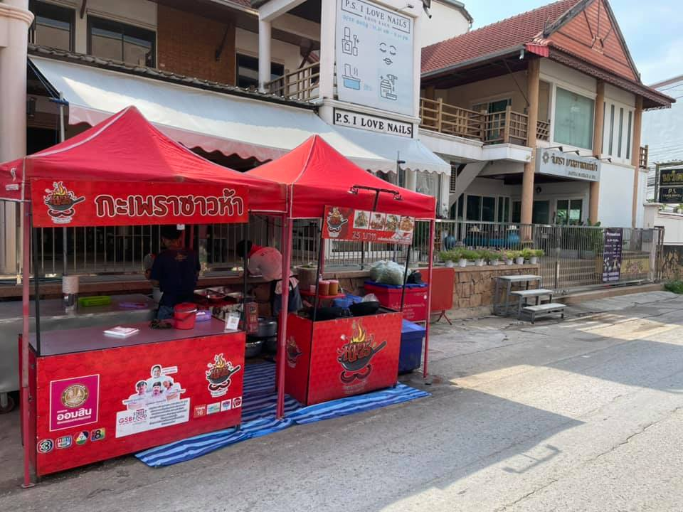</img>

*อ้างอิงข้อมูลและภาพจาก:* [Facebook Fan Page](https://www.facebook.com/%E0%B8%81%E0%B8%B0%E0%B9%80%E0%B8%9E%E0%B8%A3%E0%B8%B2%E0%B8%8B%E0%B8%B2%E0%B8%A7%E0%B8%AB%E0%B9%89%E0%B8%B2-%E0%B8%AA%E0%B8%B2%E0%B8%82%E0%B8%B2-%E0%B8%81%E0%B8%B1%E0%B8%87%E0%B8%AA%E0%B8%94%E0%B8%B2%E0%B8%A5-1480020018790009/)

> ร้านกะเพราซาวห้า
> เวลาเปิด 11.00 - 21.30 น. 
> หน้าร้านนวด จันทรา กังสดาล ซอยวุ่นวาย

#### 8. Beta House (เบต้าเฮาส์)สาขา 2 

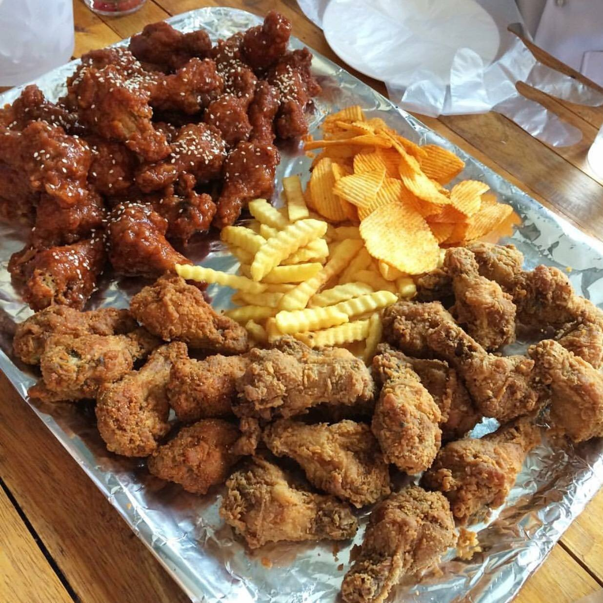</img>

*อ้างอิงข้อมูลและภาพจาก:* [Wongnai](https://www.wongnai.com/restaurants/247697ZH-beta-house-%E0%B8%AA%E0%B8%B2%E0%B8%82%E0%B8%B2-2)

> ร้านBetahouse สาขา2
> เวลาเปิด 11.00 - 23.59 น. 
> กังสดาล ขอนแก่น

#### 9. Mark FC (มาร์ค เอ็ฟซี) 

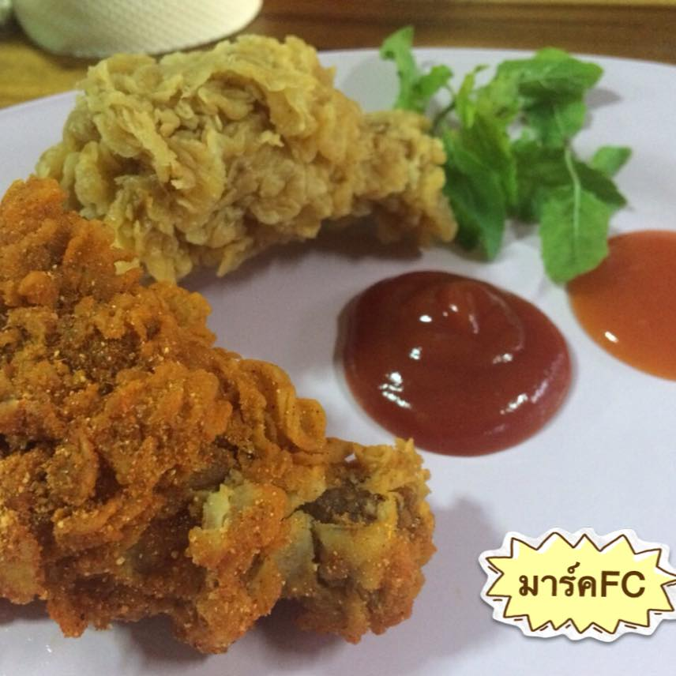</img>

*อ้างอิงข้อมูลและภาพจาก:* [Facebook Fan Page](https://www.facebook.com/MarkFC.KHONKAEN/)

> ร้านMark FC
> เวลาเปิด 7.30 - 23.30 น.
> หลังมอ ขอนเเก่น

#### 10. Because Kitchen

</img>

>GRAB MEGA SALE ชุดอิ่มคุ้ม
>"ลด 40%"

- กะเพราหมูสับพริกแห้ง
- ผัดพะแนงหมูชิ้น
- ไส้กรอกไก่ทอด
- ข้าวเปล่า 2

📣ทั้งหมดนี้แค่ 149.- บาท (ลดจาก 239.-)
`Open: 11:00 - 16:00`

*อ้างอิงข้อมูลและภาพจาก:* [Because Kitchen](https://www.facebook.com/Because-Kitchen-108135888153512/?ref=page_internal)

#### 11. กะบับไก่ชีสพัทยาในตำนาน สาขาขอนแก่น 

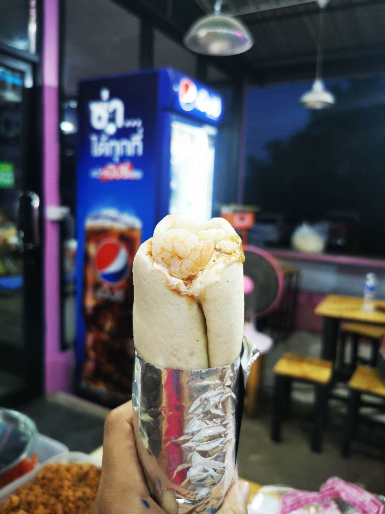</img>

*อ้างอิงข้อมูลและภาพจาก:* [Wongnai](https://www.wongnai.com/restaurants/483210ft-กะบับไก่ชีสพัทยาในตำนาน-สาขาขอนแก่น)

> ร้านกะบับไก่ชีสพัทยาในตำนาน สาขาขอนแก่น
> เวลาเปิด 11.30 - 23.59 น. 
> ตลาดอามามอลล์ หลังมหาวิทยาลัยขอนแก่น

#### 12. สถานีอิ่มเอม EIM EM Station

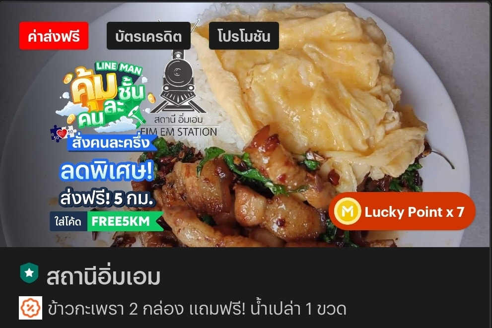</img>

*อ้างอิงข้อมูลและภาพจาก:* [Facebook Fan Page](https://www.facebook.com/Tell0926239874/?ref=page_internal)

> สถานีอิ่มเอม EIM EM Station 
> เวลาเปิด 9.00 - 23.00 น. 
> หลังมหาวิทยาลัยขอนแก่น
