# KKU Food Journey 2022
## The ultimate guide to good foods and drinks around Khon Kaen University

Visiting KKU for the first time? This guide will give you mouthwatering choices around KKU through the experiences of the locals.

## Quick Links
* [Must Try](#musttry)
* [Cafe](#cafe)
* [Street Foods](#street)
* [Authentic E-SAN Foods](#esan)
* [Fine Dining and Restaurants](#finedin)
* [Public Events](#event)
* [Grab and Go](#grab)

## Must Try!! :rice: :ramen:
Something you can not miss when visiting KKU

#### 1. ขนมโตเกียว หน้าคณะวิทยาการจัดการ
> ขายดีจนต้องขยายสาขา มีหลากหลายไส้ให้เลือก ราคาย่อมเยาว์
> เวลาเปิด-ปิด: 9:00-18:00 น.
> พิกัด: ศูนย์บริการอาหาร 4 ใต้ที่จอดรถคณะวิทยาการจัดการ

#### 2. Lean Station

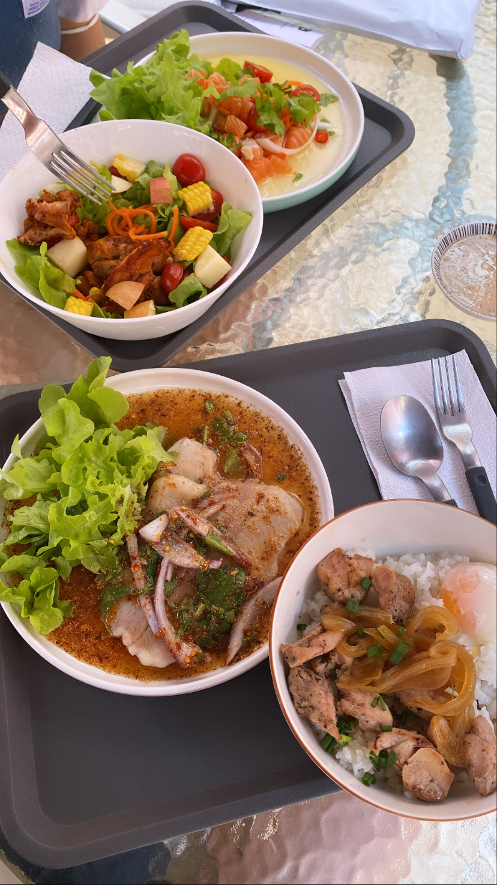

  * ร้านขายอาหารรักสุขภาพ อาหารและเครื่องดื่มอร่อย
  * เมนูแนะนำ ลาบแซลมอนซาซิมิ
  * เวลาเปิด-ปิด : 11:00 - 19:00 น.
  * พิกัด : หอพักอินเตอร์ มหาวิทยาลัยขอนแก่น

#### 3. พิสมัย

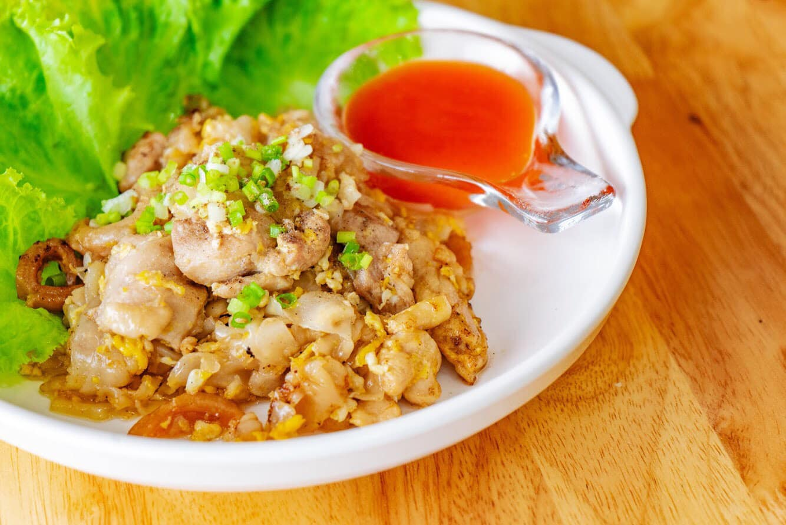

*อ้างอิงข้อมูลและภาพจาก:* [FB Fan Page](https://www.facebook.com/%E0%B8%9E%E0%B8%B4%E0%B8%AA%E0%B8%A1%E0%B8%B1%E0%B8%A2-324692708372559/)

  * อาหารจานเดียว ก๋วยเตี๋ยว เบเกอรี/เค้ก 
  * ร้านเปิดวันจันทร์ - เสาร์ เวลา 10:30 - 20:30 น.
  * พิกัด : ซอยโกโก้มอ ตรงข้ามสนามหญ้าเทียม

## Cafe :coffee: :cake: :tea:
Here are the best places where you can enjoy your a cup of coffee and delicious desserts.
#### 1. Cafe de Forest

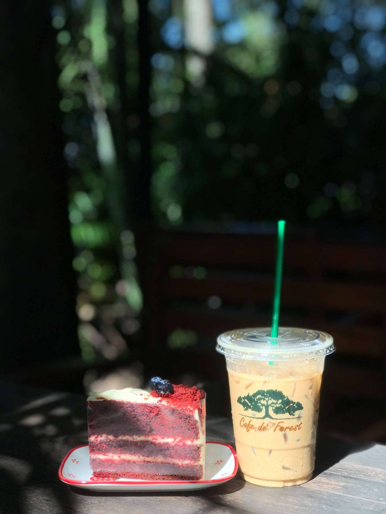

*อ้างอิงข้อมูลและภาพจาก:* [FB Fan Page](https://www.facebook.com/cafedeforestkhonkaen/)

> คาเฟ่ในบรรยากาศสวนและปา ภายในรั้ว มข.
> เวลาเปิด-ปิด : 8:00-18:00 น.
> พิกัด: อยู่หลังสนามกีฬา 50 ปี ใกล้คณะเทคโนโลยี และสะพานขาว

#### 2. 𝐍𝐚𝐩'𝐬 𝐂𝐨𝐟𝐟𝐞𝐞 𝐱 𝐊𝐡𝐨𝐧 𝐊𝐚𝐞𝐧

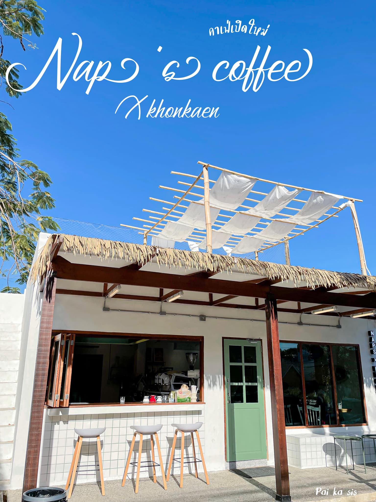

*อ้างอิงข้อมูลและภาพจาก:* [Pai ka sis :ไปค่ะซิส ツ](https://www.facebook.com/permalink.php?story_fbid=405285714614604&id=108801770929668)

> คาเฟ่ขอนแก่น ฟิลดี เหมือนอยู่ริมทะเล เครื่องดื่มดีงามครัวซองค์สดใหม่ 
> เวลาเปิด-ปิด : 7:00-16:00 น.
> พิกัด: ตลาด62blocks หลังสนามหญ้าเทียม

#### 3. Juicer Coffee

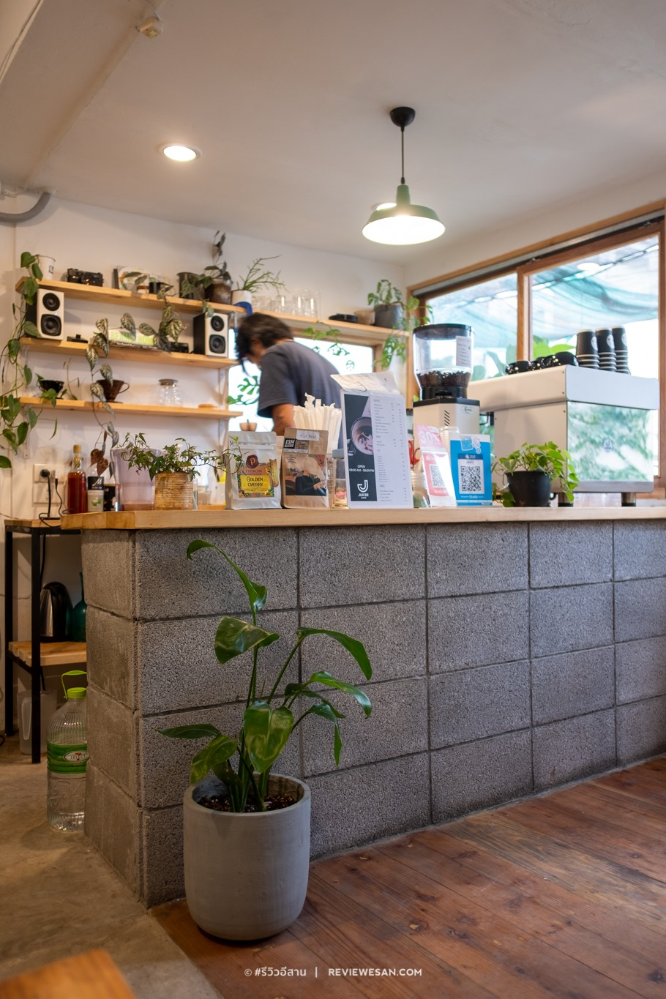

*อ้างอิงข้อมูลและภาพจาก:* [รีวิวขอนแก่น ](https://www.facebook.com/640465002729303/posts/4019355071506929)

> คาเฟ่เล็กๆที่ลึกลับ บรรยากาศอบอุ่น มุมถ่ายรูปเยอะ ใครที่รักธรรมชาติพลาดไม่ได้เลย ที่สำคัญเครื่องดื่มราคาย่อมเยาเข้าถึงง่าย :star::star:
> เวลาเปิด-ปิด : 08.00-18.00 น.
> พิกัด: [หลังมข.ใกล้หอพักเรือนไทยไม้งาม](https://goo.gl/maps/xTCXZpQRPcw5n2aD6)

#### 4. Times Square สาขากังสดาล 

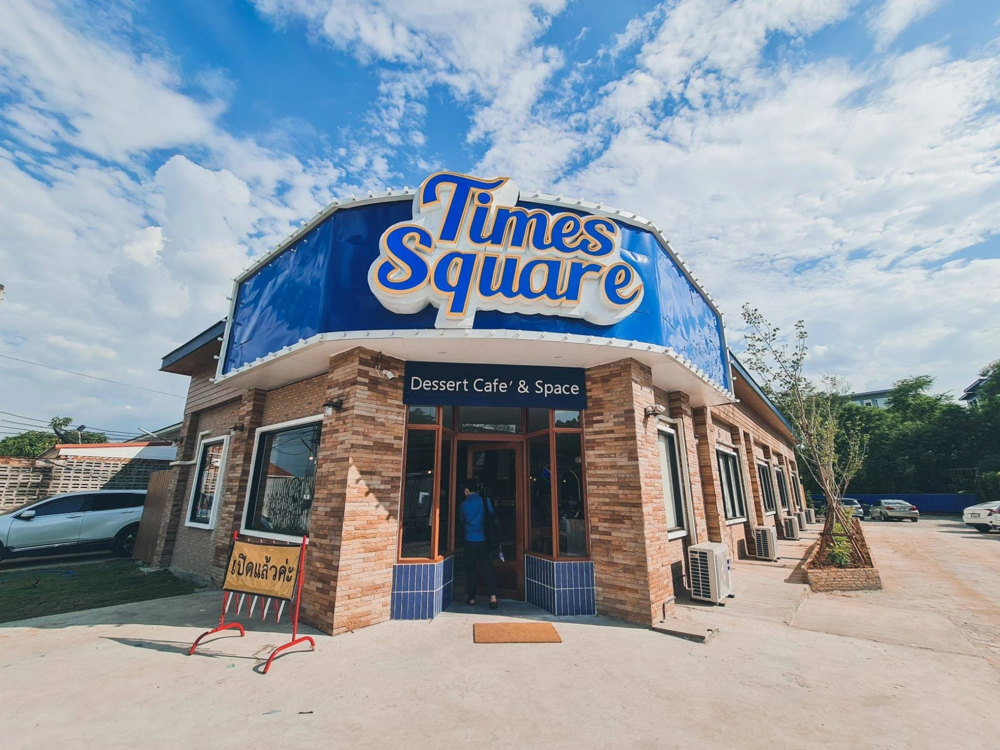

*อ้างอิงข้อมูลและภาพจาก:* [wongnai ](https://www.wongnai.com/reviews/55a89f524b444e7bbb6754d54d0bb8f2)

> คาเฟ่ที่นั่งกว้าง นั่งสบาย บรรยากาศดีมีความเป็นส่วนตัว ปิดดึก เมนูมีทั้งคาวและหวาน 🍨🍦 
> เวลาเปิด-ปิด : 11.00-23.00 น.
> พิกัด: [อยู่ติดร้านปลาวาฬใจดีสาขากังสดาล](https://goo.gl/maps/A7D7qYrngy9LcuwE7)

#### 5. ฌานไม้ 

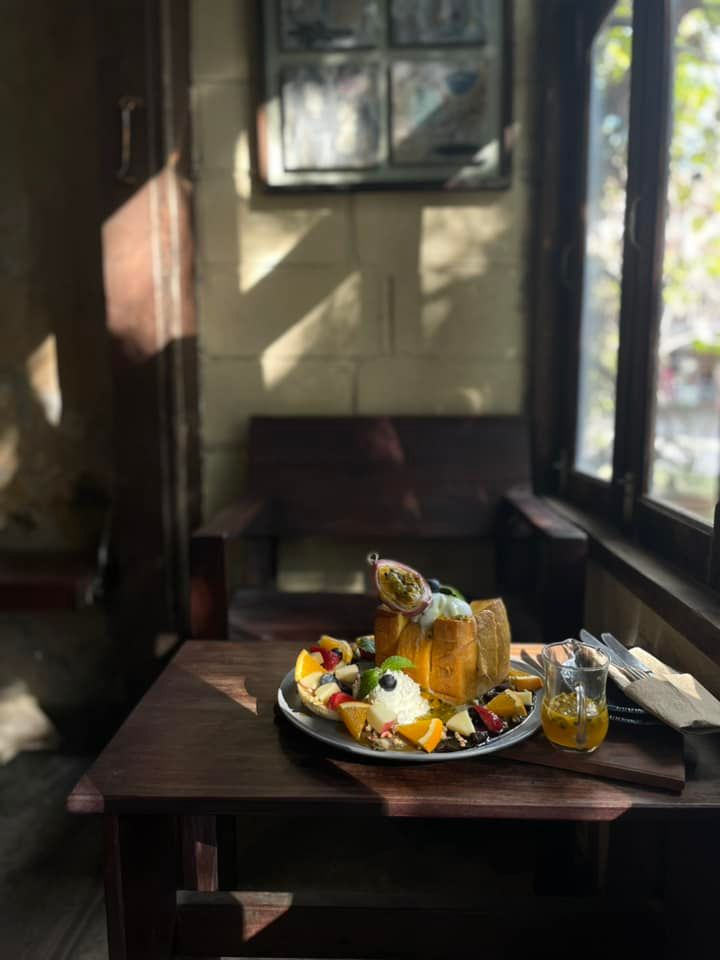

*อ้างอิงข้อมูลและภาพจาก:* [FB Fan Page]https://web.facebook.com/%E0%B8%8C%E0%B8%B2%E0%B8%93%E0%B9%84%E0%B8%A1%E0%B9%89-306572890176452/

> ร้านอาหารกึ่งคาเฟ่ ภายในรั้ว มข.
> เวลาเปิด-ปิด : 8:00-21:00 น.
> > พิกัด: ฝั่งกังสดาล มหาวิทยาลัยขอนแก่น ใกล้กันกับร้าน Sri Brown Cafe

#### 6. InWhite Café

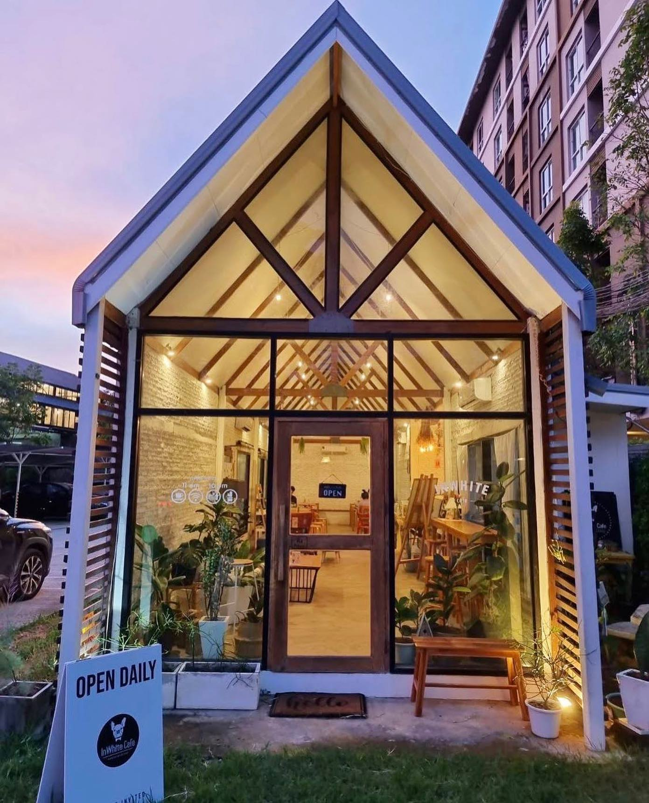

*อ้างอิงข้อมูลและภาพจาก:* [FB Fan Page](https://www.facebook.com/inwhitecafekk)

> ร้านคาเฟ่สุดชิลพร้อมเครื่องดื่มเเสนอร่อย~
> เวลาเปิด-ปิด : 11:00-22:00 น.
> > พิกัด: ฝั่งกังสดาล มหาวิทยาลัยขอนแก่น ข้างร้าน โอปอ.บุฟเฟต์ 

#### 7. Gravity Coffee Space

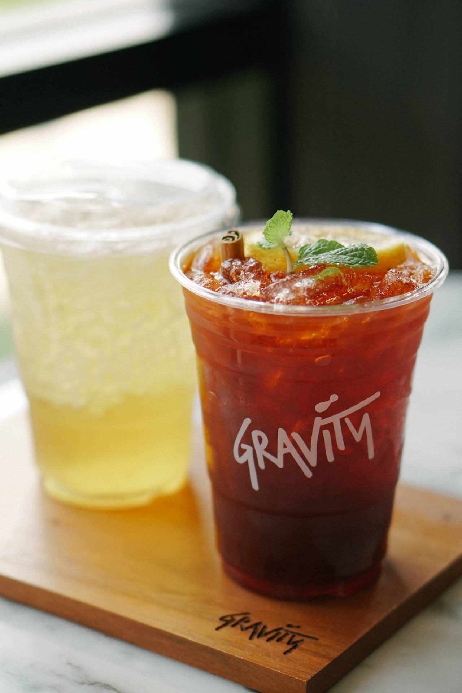

*อ้างอิงข้อมูลและภาพจาก:* [Wongnai](https://www.wongnai.com/restaurants/418245rv-gravity-coffee-space)

> ร้านกาแฟ บรรยากาศดี เหมาะแก่การนั่งชิว
> เปิดทุกวัน 08.00-17.00 น.
> > พิกัด:ใกล้ สมาคมศิษย์เก่ามหาวิทยาลัยขอนแก่น

#### 8. ชาโบว์

*อ้างอิงข้อมูลและภาพจาก:* [FB Fan Page](https://www.facebook.com/1506654109551742/posts/1597155350501617/)

> ร้านกาแฟ กินทันที อิ่มแล้วจ๊า
> เปิดทุกวัน 08.00-21.00 น.
> > พิกัด:ใกล้ สมาคมศิษย์เก่ามหาวิทยาลัยขอนแก่น

#### 9. Cocoa More
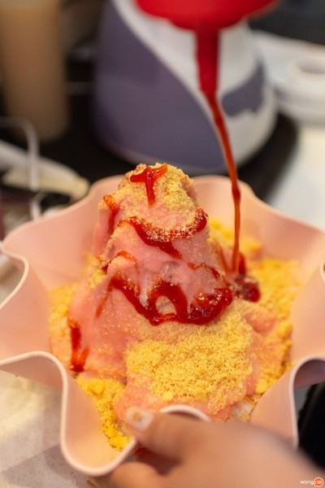

*อ้างอิงข้อมูลและภาพจาก:* [Wongnai](https://www.wongnai.com/news/cocoa-more-khonkaen)

> โกโก้เข้มข้น รสชาติโกโก้แท้ สูตรเฉพาะของร้านเท่านั้น 
> เปิดทุกวัน 16:00-23:59 น.
> > พิกัด:ตั้งอยู่ติดถนนริมรั้วหลังมข. ประตูเขียว หรือถนนเส้นหลังหออินเตอร์ ร้านจะอยู่เลยคลีนิกหมอฟันมานิดนึง ก่อนถึงสีนานวลสาขาหลังมข 

#### 10. นมวัวบิน

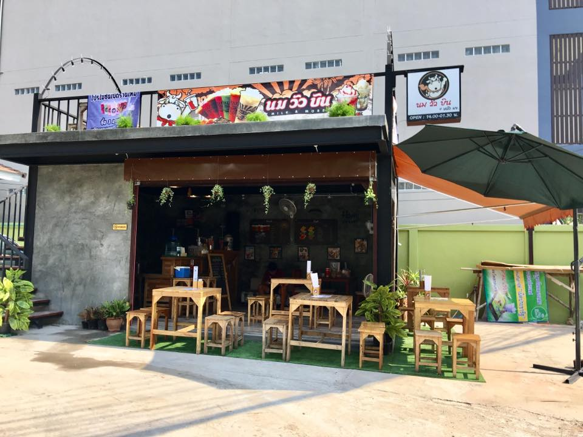

*อ้างอิงข้อมูลและรูปภาพจาก:* [Facebook Fan Page](https://www.facebook.com/Nomvubin)

> เป็นคาเฟ่ที่อยู่ใกล้ ม บรรยากาศดี ราคาก็ดี
> เวลาเปิด-ปิด : 9:00-21:00 น.
> พิกัด: ถนนหลัง มข. เยื้องซุยซุยบาร์ ร้านอยู่ติดกับก๋วยเตี๋ยวเรือสิบสาม

## Street Foods :moneybag: :innocent:
On budget? No problem. There are plenty of delicious and affordable foods around KKU.
#### 1. ศุนย์อาหารและบริการ 2 มข. (โรงชาย)
> ถูกและดี มีอยู่จริง!! มีอาหารให้เลือกหลากหลาย ทั้งข้าวราดแกง อาหารตามสั่ง ก๋วยเตี๋่ยว ผลไม้ และขนมหวาน ตั้งแต่ราคาหลักสิบถึงหลักร้อย
> พิกัด: เยื้องสนามกีฬากลาง มข.
> เวลาเปิด-ปิด: ตลอดเวลา

#### 2. ข้าวมันไก่พี่ยัด ศูนย์อาหารยูเซนเตอร์
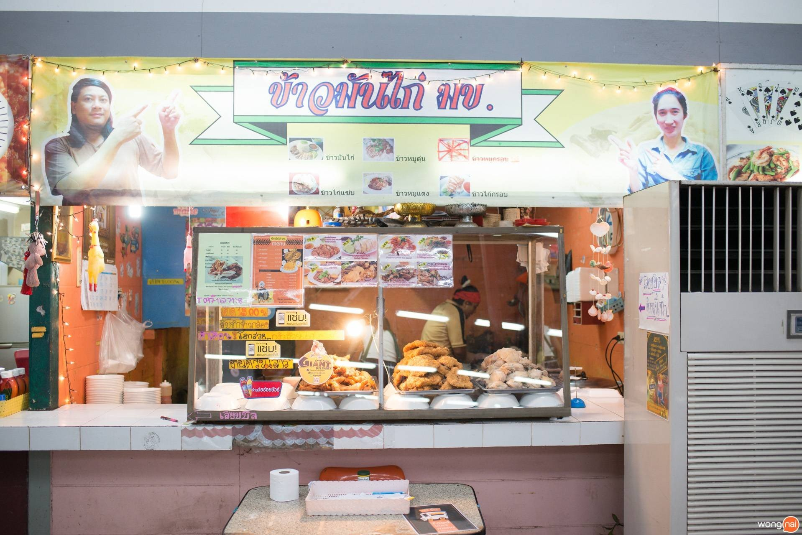
รูปภาพจาก https://www.wongnai.com/restaurants/271528hN271528hN-ข้าวมันไก่-มข

> หิวๆต้องมา ถูก ให้เยอะมากกกกกกกกก กไก่ ล้านตัว ในราคาปกติ 40บาทเท่านั้น 
> พิกัด: U-center 

#### 3. ก๋วยเตี๋ยว & กะเพรา By คุณเสริม

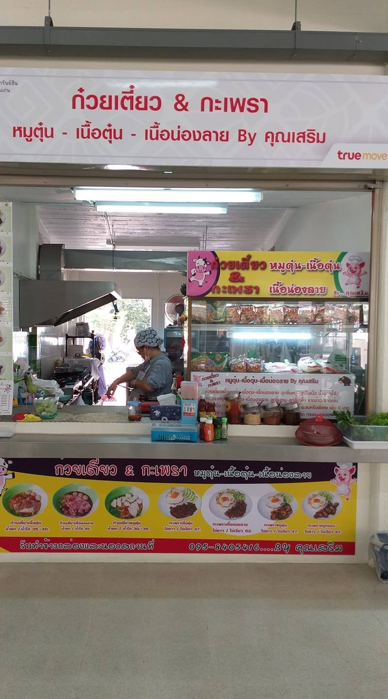</img>

*อ้างอิงข้อมูลและภาพจาก:* [Facebook Fan Page](https://www.facebook.com/เตี๋ยวเนื้อตุ๋นหมูตุ๋นกะเพราน่องลายbyคุณเสริมสาขาโรงอาหารชาย-มข-639855569773571)

> หนึ่งในร้านขายกะเพราที่เรียกได้ว่าอร่อยมากๆ ภายใน มข. นอกจากนี้ยังมีเมนูประเภทก๋วยเตี๋ยวให้ลิ้มลอง
> เวลาเปิด 07.00-16.00 น. (ถ้าวัตถุดิบหมดก็จะปิดร้านทันที)
> พิกัด ศูนย์อาหารและบริการ 2 (โรงชายใหม่) ตรงข้าม สนามกีฬา 50 ปี

#### 4. โบโบ้เครป&นมสด หลังมอ
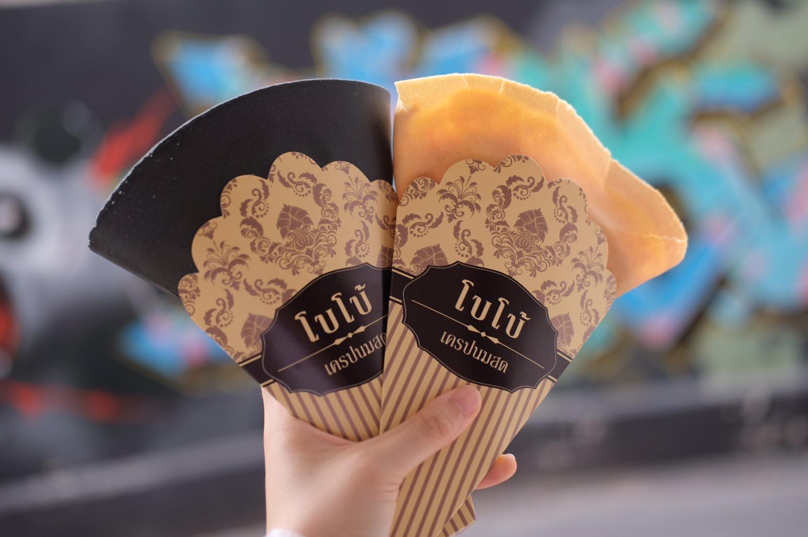

*อ้างอิงรูปภาพจาก:* [เครปโบโบ้ สาขาแฟรี่](https://www.facebook.com/%E0%B9%80%E0%B8%84%E0%B8%A3%E0%B8%9B%E0%B9%82%E0%B8%9A%E0%B9%82%E0%B8%9A%E0%B9%89-%E0%B8%AA%E0%B8%B2%E0%B8%82%E0%B8%B2%E0%B9%81%E0%B8%9F%E0%B8%A3%E0%B8%B5%E0%B9%88-107714670918042/)

  * เป็นร้านเครปที่ให้ไส้เยอะมาก และอร่อยมาก มีไส้และแป้งให้เลือกหลากหลายและราคาถูก
  * เวลาเปิด-ปิด : 18:00 - 23:30 น.
  * พิกัด : หลังมอ เยื้องกับสถานีตำรวจภูธรย่อย มข

#### 5. โซล ชิกเก้น (กังสดาล)

*อ้างอิงรูปภาพจาก:* [Foodpanda ](https://www.foodpanda.co.th/th/restaurant/v7up/seoul-chicken-kangsadarn)

  * เป็นร้านอาหารเกาหลีที่อร่อยมากๆ ไก่มีความใกล้เคียงกับ Bonchon
  * แนะนำซอสเผ็ดอร่อยมากกกกกกกกกกกกกกกกกก
  * ราคาอยู่ในระดับกลางๆ
  * เวลาเปิด-ปิด : 11:00 - 20:45 น.
  * พิกัด : กังสดาล [Google Maps](https://goo.gl/maps/nwu9VKXpzxujQcDq6)

#### 6. มหาเจียว หลังมอ
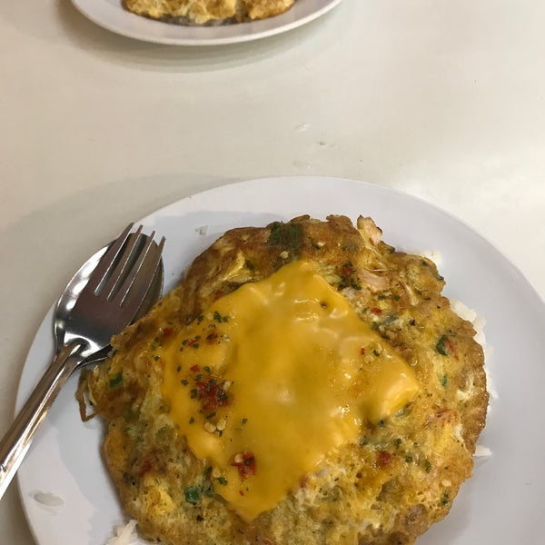

*อ้างอิงรูปภาพจาก:* [Foodpanda](https://www.foodpanda.co.th/th/restaurant/z1jc/maha-fast-food-by-maha-jieow)

  * เป็นร้านอาหารตามสั่งที่มีความโดดเด่นคือเมนูไข่เจียวใส่ชีส
  * แนะนำให้ใส่ชีสแผ่นเพิ่ม
  * เวลาเปิด-ปิด : 10:00 - 20:00 น.
  * พิกัด : หลังมอแถว U-Center
 
 
#### 7. ซัวเถา

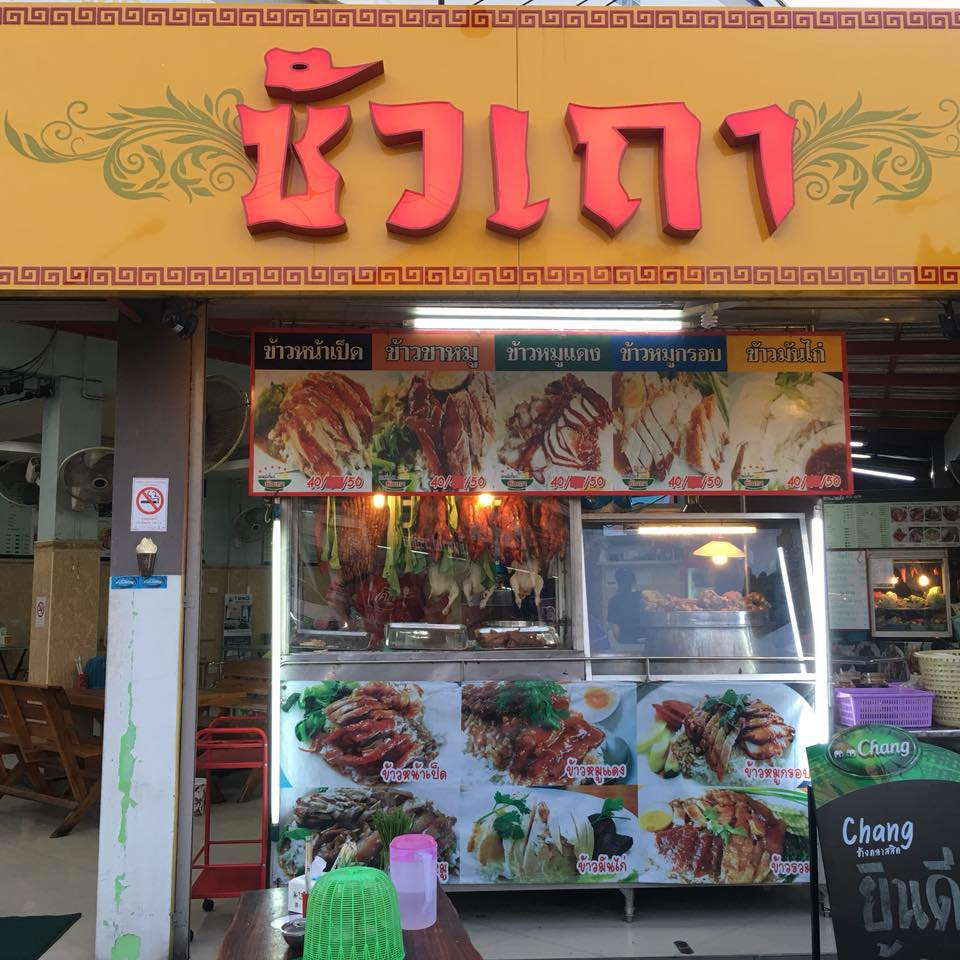

*อ้างอิงข้อมูลและภาพจาก:* [FB Fan Page]https://www.facebook.com/%E0%B8%A3%E0%B9%89%E0%B8%B2%E0%B8%99%E0%B8%8B%E0%B8%B1%E0%B8%A7%E0%B9%80%E0%B8%96%E0%B8%B2%E0%B8%82%E0%B8%AD%E0%B8%99%E0%B9%81%E0%B8%81%E0%B9%88%E0%B8%99-1513780165592189

> ร้านอาหารสไตล์ไทย-จีน 
> เวลาเปิด-ปิด : 13:00-22:00 น.
> > พิกัด: ถ.ชวนชื่น ตำบลในเมือง อำเภอเมืองขอนแก่น จ.ขอนแก่น

#### 8. มะม่วงป้ากุ้ง
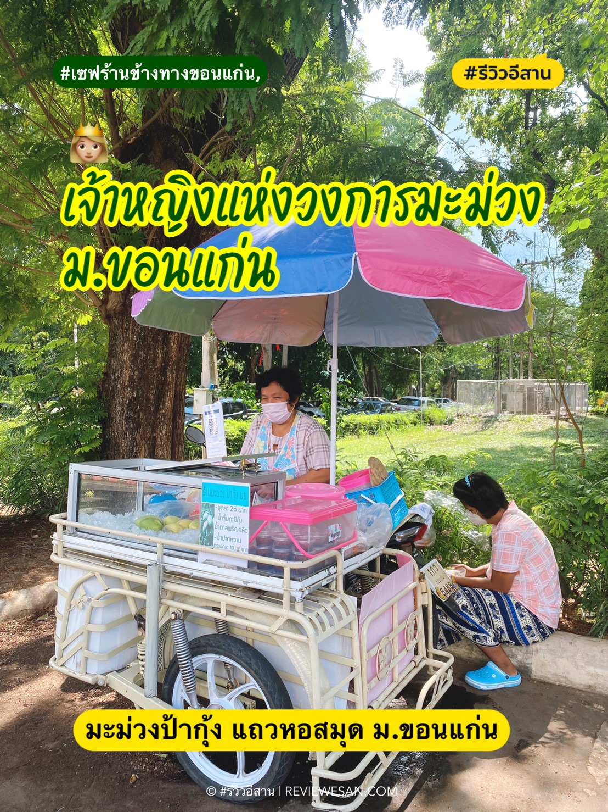

*อ้างอิงรูปภาพจาก:* [Facebook : รีวิวอีสาน ](https://www.facebook.com/reviewkhonkaen/photos/pcb.3713221498786956/3713215475454225)

  * ร้านมะม่วงที่ได้มะม่วงเยอะมากกกก คุ้มค่าในราคา 25 บาท
  * แถมน้ำจิ้มก็เด็ดมากกก อร่อยมากๆ ทุกคนจะได้ชิมมะม่วงในรสชาติที่ตัวเองชอบ
  * เวลาเปิด ประมาณ 11.00 - 18.00 น.
  * พิกัด : ข้างหอสมุด เยื้องทางคณะเกษตรศาสตร์

#### 9. สามอ้วนชวนกิน
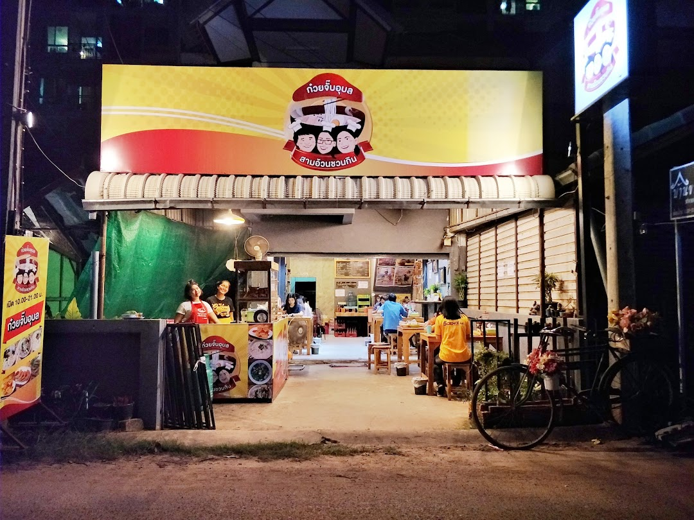

*อ้างอิงรูปภาพจาก:* [สามอ้วนชวนกิน](https://www.google.com/maps/uv?pb=!1s0x31228a9a122fab65%3A0x572dd093185c6e77!3m1!7e115!4shttps%3A%2F%2Flh5.googleusercontent.com%2Fp%2FAF1QipOZQnbf9kbb1EmqDWQeWXIyIeJwZa3lfyLuBo0v%3Dw213-h160-k-no!5z4Liq4Liy4Lih4Lit4LmJ4Lin4LiZ4LiK4Lin4LiZ4LiB4Li04LiZIOC4geC5i-C4p-C4ouC4iOC4seC5iuC4muC4reC4uOC4muC4pSAtIEdvb2dsZSBTZWFyY2g!15sCgIgAQ&imagekey=!1e10!2sAF1QipOZQnbf9kbb1EmqDWQeWXIyIeJwZa3lfyLuBo0v&hl=en&sa=X&ved=2ahUKEwjCpo2w0Kz1AhVqTWwGHcYFAxsQoip6BAglEAM#)

  * แนะนำเมนู ก๋วยจั๊บอุบล
  * เวลาเปิด ประมาณ 11:00 - 19:00 น.
  * พิกัด : ซอยอิงมอ 3

## Authentic E-SAN Foods :cow: :evergreen_tree: :evergreen_tree: :horse:
Wanna eat like the locals? Try these.

#### 1. มิตรภาพลาบก้อย

รูปภาพจาก https://www.wongnai.com/photos/06f2d745f2164661b256421a8a42a565

> เวลาเปิด-ปิด : 16:00 - 11:00 น. 
> พิกัด: ถนนมิตรภาพ

## Fine Dining and Restaurants  :camera: :sunflower:
Love to impress you Instragram followers? Here are the places where you can take stunning pictures, nice foods, and excellent services.

#### 1. Bayasita@KKU
> ไหว้เจ้าพ่อมอดินแดงเสร็จไปรับประทานอาหารในบรรยากาศหรูหราต่อ ให้บริการทั้งร้านอาหาร ที่พัก และคาเฟ่ มีบริการอาหารที่ทำจากผลผลิตภายในรั่วมหาวิทยาลัยขอนแก่น
> พิกัด: ตรงข้ามเจ้าพ่อมอดินแดง ติดคณะสัตวแพทยศาสตร์

#### 2. สเต็กบ้านเต้ง สาขา ม.ขอนแก่น

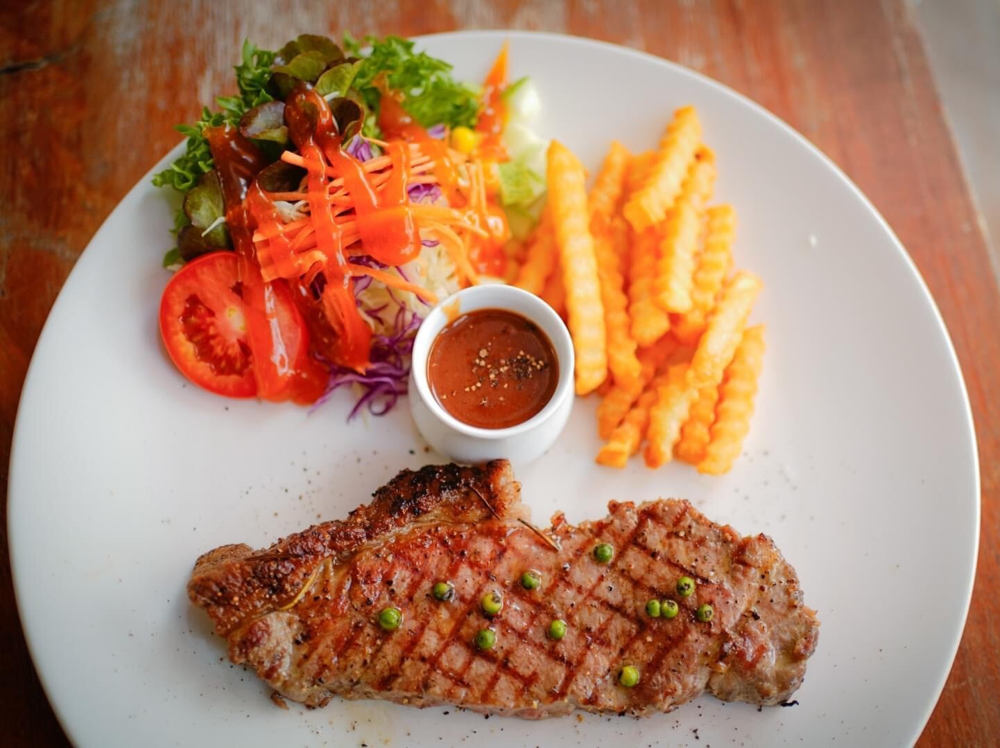

*อ้างอิงข้อมูลและภาพจาก:* [สเต็กบ้านเต้ง ม.ขอนแก่น & Mr.Teng Steak](https://www.facebook.com/Steakbaantengkk)

> ต้นตำรับสเต็กบ้านเต้ง รสชาติที่ทุกคนคุ้นเคย 10 ปี
ร้านเปิดทุกวัน ตั้งแต่ 10.00-22.00น.
โทร: 083-4569270
พิกัด: ที่ตั้ง ริมบึงหนองแวงตราชู ฝั่งกังสดาล อ.เมือง จ.ขอนแก่น

#### 3. T-Bone Steak 

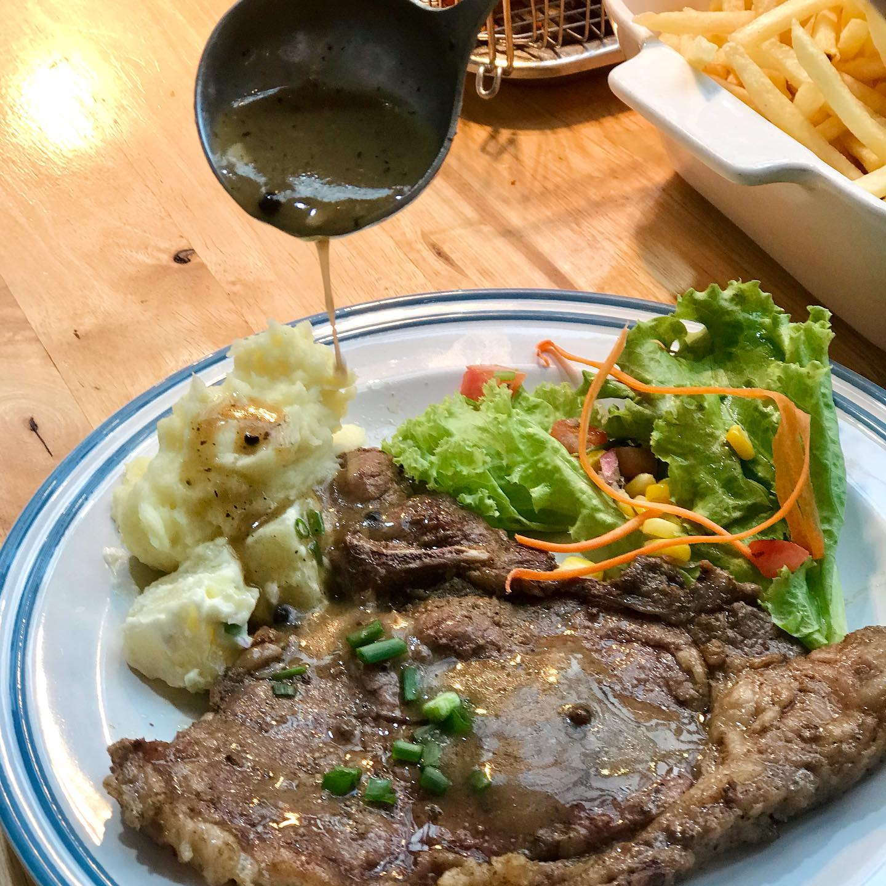

*อ้างอิงข้อมูลและภาพจาก:* [T-Bone Steak](https://www.facebook.com/tbonekk/photos/a.3794468787251502/3873879389310441/)

> ไม่พูดมาก เพราะมันอร่อยมากกกกกกกกก
ร้านเปิดทุกวัน ตั้งแต่ 17.00-23.00น.
โทร: 094 542 8366
พิกัด: ที่ตั้ง 204/150 หมู่14 เทศบาลนครขอนแก่น ฝั่งกังสดาล อ.เมือง จ.ขอนแก่น 40000

#### 4. รอยยิ้มสเต๊ก 

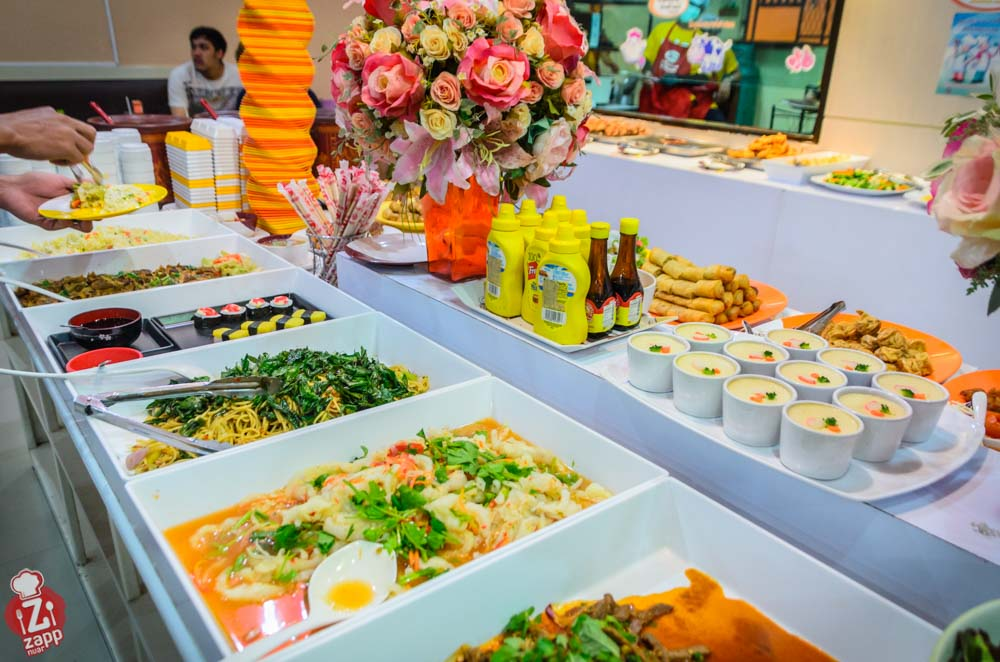

*อ้างอิงข้อมูลและภาพจาก:* [รอยยิ้มสเต๊ก](https://zappnuar.com/review-khonkaen/%E0%B8%A3%E0%B8%AD%E0%B8%A2%E0%B8%A2%E0%B8%B4%E0%B9%89%E0%B8%A1%E0%B8%AA%E0%B9%80%E0%B8%95%E0%B9%8A%E0%B8%81%E0%B8%99%E0%B8%A1%E0%B8%AA%E0%B8%94/)

> เมนูสเต๊กที่ร้านนี้ คือมีให้สเต๊กให้เลือกทานกันหลากหลายประเภท ไม่ว่าจะเป็น หมู ไก่ ปลา หรือแม้กระทั่งสเต๊กเนื้อโคขุน นอกจากเมนูสเต๊กแล้ว ที่ร้านนี้ยังมีในส่วนของอาหารอื่น ๆ อีกมากมาย เรียกได้ว่าเลือกทานกันไม่หวาดไม่ไหวเลยทีเดียว อร่อยไม่แพ้สเต๊กเลย
ร้านเปิดทุกวัน ตั้งแต่ 16.00-22.00น.
โทร: 089-942-5157
พิกัด: ที่ตั้ง 222/12 ถนนกัลปพฤกษ์ ฝั่งกังสดาล-ชุมชนตะวันใหม่ ต.ในเมือง, 40000 อ.เมือง ขอนแก่น (ร้านอยู่ในซอยร้านประจำ ข้างฌาร์ม บูทีค รีสอร์ท)

#### 5. สีนานวล คาเฟ่ กังสดาลมข.

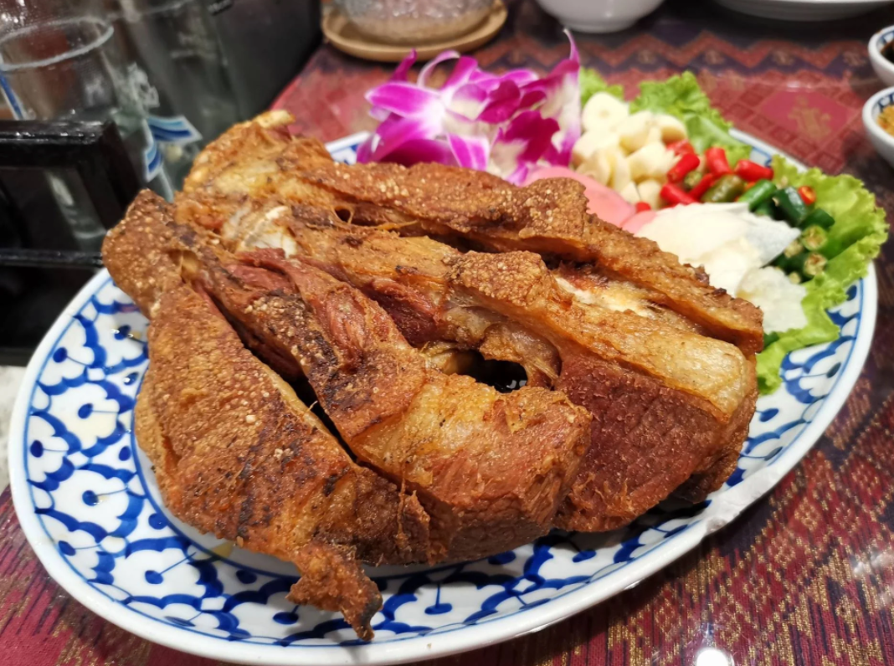

*อ้างอิงข้อมูลและภาพจาก:* [wongnai](https://www.wongnai.com/listings/must-try-restaurants-khonkaen)

>ร้านอาหารเมนูน่ากิน รสชาติดี ร้านตำนานในขอนแก่น ร้านตกแต่งมีสไตล์ อาหารที่นี่ใส่ภาชนะมาเสิร์ฟดูสวยงาม เมนูเด็ด “ปลากะพงยำมะม่วง” และ “แกงส้มชะอมกุ้ง” อาหารอร่อย และมีคุณภาพ ร้านนี้เหมาะที่จะพาครอบครัวมากิน อาหารมีหลากหลาย เข้ากับทุกคนในครอบครัว 
โทร: 043001200
พิกัด: 164 160 หมู่ที่ 14 ถนน ตะวันใหม่ ตำบลในเมือง อำเภอเมืองขอนแก่น ขอนแก่น 40000

## Public Events :dancer: :dancers:
Looking for souvenirs or buying the essestials? There are many places for you to go.  KKU is full of public events with food stalls. Some are free. Some are not. Here is the list.

##  Grab and Go :running: :muscle:
In a rush? Let's grab a bite to eat.

#### 1. ผัดไทยไร้เส้น-ตลาดหอแปดหลัง

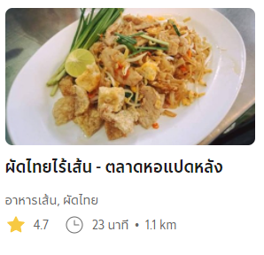</img>

*อ้างอิงข้อมูลและภาพจาก:* [food.grab.com/th](https://food.grab.com/th/th/restaurant/ผัดไทยไร้เส้น-ตลาดหอแปดหลัง-delivery/3-CZACAYBJR8MAGN)

<ul>
<li>> แนะนำกะเพราไก่อร่อยมาก</li>
<li>> เวลาเปิด 07:30-20:30 น.</li>
<li>> พิกัด ตลาดหอแปดหลัง</li>
</ul>

#### 2. ไก่จ๋า - ตลาดมอดินแดง
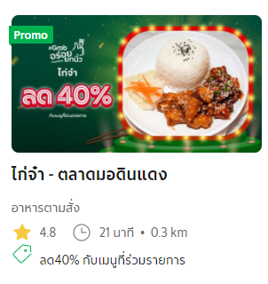

*อ้างอิงข้อมูลและรูปภาพจาก:* [ไก่จ๋า - ตลาดมอดินแดง](https://food.grab.com/th/th/restaurant/%E0%B9%84%E0%B8%81%E0%B9%88%E0%B8%88%E0%B9%8B%E0%B8%B2-%E0%B8%95%E0%B8%A5%E0%B8%B2%E0%B8%94%E0%B8%A1%E0%B8%AD%E0%B8%94%E0%B8%B4%E0%B8%99%E0%B9%81%E0%B8%94%E0%B8%87-delivery/3-CZJTA35CCLAHR2)

  * ร้านขายมาม่าและไก่เกาหลี ซอสมาม่าอร่อยมากก เหมาะสำหรับคนที่ไม่ชอบมาม่าที่แห้งเกินไป
  * เวลาเปิด : 16:00 น.
  * พิกัด : ศูนย์อาหารและบริการ 3 (หนองแวง)
